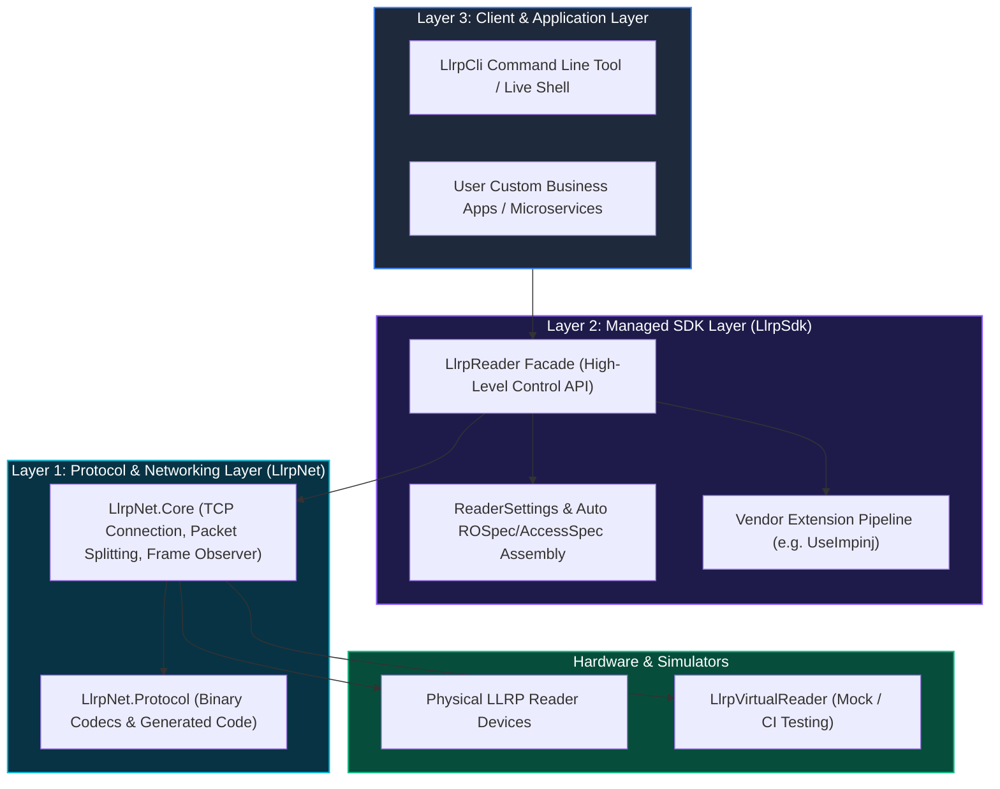
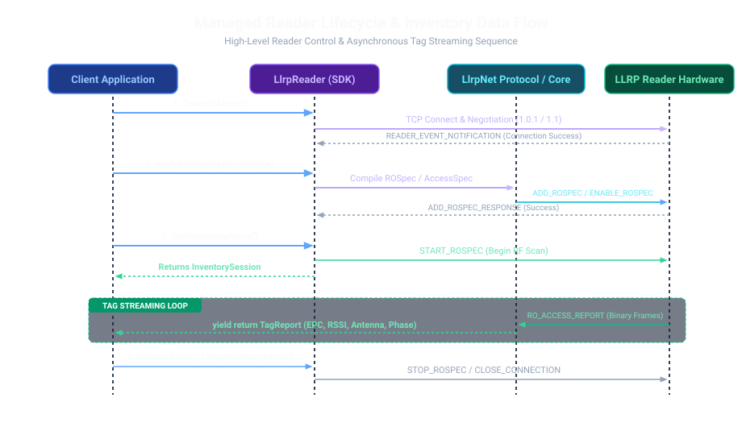

# LLRPCSharp

[中文](README.zh.md)


**LLRPCSharp** is a modern, high-performance .NET implementation of the Low Level Reader Protocol (LLRP) for RFID readers.

It modernizes traditional LTK.NET approaches for contemporary **.NET 10.0** applications, separating generated protocol assets, binary codecs, async transport, reader state, and application workflows into clean, decoupled layers.

---

## 🏛️ System Architecture

LLRPCSharp is organized into three distinct layers so developers can choose the right entry point without needing to master the entire repository:


<details>
<summary><b>View Native Mermaid Architecture Diagram</b></summary>



</details>

### 💡 3-Layer Breakdown Explained

#### 1. Layer 3 · Client & Application Layer
* **`LlrpCli` Command Line Tool**: An out-of-the-box Live Shell interactive console and command execution entry point for operations, debugging, and agent scripts.
* **Custom Business Applications**: User RFID applications, backend microservices, or integration agents built on top of `LlrpSdk`.

#### 2. Layer 2 · Managed SDK Layer (`LlrpSdk`)
* **Problem Solved**: Traditional raw LLRP required callers to manually construct verbose, low-level binary `ROSpec` (inventory rules) and `AccessSpec` (memory access rules). `LlrpSdk` hides all these complex protocol details.
* **`LlrpReader` Facade**: Represents a single RFID reader device, exposing high-level methods like `ConnectAsync()` (auto protocol negotiation), `ApplySettingsAsync()` (one-line antenna & power configuration), and `StartInventoryAsync()` (start scanning).
* **State Management & Report Translation**: Manages connection state machines and automatically translates raw binary `RO_ACCESS_REPORT` messages into clean `TagReport` streams (EPC, Antenna ID, RSSI, Phase, Read Count), while supporting vendor extension pipelines (e.g. `UseImpinj()`).

#### 3. Layer 1 · Protocol & Networking Layer (`LlrpNet`)
* **Core Responsibility**: Low-level **LLRP binary protocol encoding/decoding** and **TCP network communications**.
* **`LlrpNet.Core` (Networking)**: Manages TCP transport lifecycles, binary frame splitting, transaction response matching, and raw frame observers.
* **`LlrpNet.Protocol` (Binary Codecs)**: Contains strongly typed LLRP messages, parameters, the `LlrpCodecRegistry`, and generated protocol assets (`.g.cs`) derived from XML/YAML protocol definitions.

#### Bottom Layer · Devices & Simulators
* **Physical LLRP Readers**: Commercial RFID hardware (Impinj, Seuic, etc.) communicating over TCP LLRP protocol.
* **`LlrpVirtualReader`**: In-memory reader simulator for hardware-free development, unit testing, and CI/CD pipelines.

---

## ⚡ Managed Reader Workflow & Lifecycle

The sequence diagram below demonstrates the managed reader lifecycle from connection and settings application to streaming tag reports:

```mermaid
sequenceDiagram
    autonumber
    actor App as Client Application / CLI
    participant Reader as LlrpReader (SDK)
    participant Protocol as LlrpNet Protocol / Core
    participant Hardware as LLRP Reader Hardware

    App->>Reader: ConnectAsync()
    Reader->>Hardware: TCP Connect & Protocol Negotiation (1.0.1 / 1.1)
    Hardware-->>Reader: Connection & Capability Response

    App->>Reader: ApplySettingsAsync(settings)
    Reader->>Protocol: Compile ROSpec / AccessSpec
    Protocol->>Hardware: ADD_ROSPEC / ENABLE_ROSPEC
    Hardware-->>Reader: Success Confirmation

    App->>Reader: StartInventoryAsync()
    Reader->>Hardware: START_ROSPEC
    Reader-->>App: Returns InventorySession

    rect rgb(15, 23, 42)
        note over Reader, Hardware: Asynchronous Tag Report Stream
        Hardware-->>Protocol: RO_ACCESS_REPORT (Binary Frames)
        Protocol-->>App: yield return TagReport (EPC, RSSI, Antenna, Phase)
    end

    App->>Reader: DisposeAsync() / StopInventoryAsync()
    Reader->>Hardware: STOP_ROSPEC & CLOSE_CONNECTION
```



<details>
<summary><b>View Native Mermaid Sequence Diagram</b></summary>



</details>

---

## 📋 Protocol & Vendor Compatibility

| Capability | Status | Details |
| :--- | :--- | :--- |
| **LLRP 1.0.1** | ✅ Supported | Complete SDK, CLI, Virtual Reader, standard ROSpec & AccessSpec operations. |
| **LLRP 1.1** | ✅ Supported Baseline | Supports negotiation, version enforcement policies, and adapter mapping. |
| **LLRP 2.0** | 🟡 Reserved | Machine-readable definition deltas exist; adapter planned. |
| **Impinj Extensions** | ✅ Supported Mainline | Strongly typed `UseImpinj()` extension pipeline, custom settings & report contributors. |

---

## 💡 Quick Start Example

### Managed SDK (`LlrpSdk`)

```csharp
using LlrpSdk.Reader;
using LlrpSdk.Settings;
using LlrpSdk.Model;

// 1. Build and connect to reader
await using LlrpReader reader = LlrpReader.CreateBuilder("192.0.2.10")
    .UseImpinj() // Enable optional Impinj vendor extension
    .Build();

await reader.ConnectAsync();

// 2. Fetch default settings and customize common parameters (Antennas, Session, Target Population, Mode, Power)
ReaderSettings defaultSettings = (await reader.GetDefaultSettingsAsync()).Settings;

ReaderSettings customSettings = defaultSettings.Edit(builder => builder
    .Inventory(inventory => inventory
        .Antennas(1, 2)             // Enable Antennas 1 & 2
        .Session(2)                 // Set Gen2 Session = 2 (0~3)
        .Population(128)            // Tag population estimate
        .Mode(modeIndex: 1000)      // RF Mode Index
        .ReportEveryTag())          // Real-time tag reporting
    .Configuration(config => config with
    {
        // Customize transmit power per antenna port (TransmitPowerIndex)
        Antennas = [
            new AntennaConfigurationSettings { AntennaId = 1, TransmitPowerIndex = 81 }, // e.g. 30 dBm
            new AntennaConfigurationSettings { AntennaId = 2, TransmitPowerIndex = 81 }
        ]
    }));

// 3. Validate and apply custom settings to reader
await reader.ApplySettingsAsync(customSettings);

// 4. Start inventory session and consume tag reports
await using InventorySession session = await reader.StartInventoryAsync();
await foreach (TagReport report in session.ReadReportsAsync())
{
    Console.WriteLine($"[Antenna {report.AntennaId}] EPC: {report.EpcHex} | RSSI: {report.PeakRssi} dBm");
}
```

---

## 🛠️ CLI Live Shell (`LlrpCli`)

Launch the interactive shell for reader operations and diagnostics:

```powershell
dotnet run --project src/LlrpCli
```

### Typical Live Shell Session

```text
connect 192.0.2.10
settings edit --from generic
settings show draft
settings apply --yes
inventory start
inventory status
inventory stop
```

For agent scripts or one-shot commands:

```powershell
dotnet run --project src/LlrpCli -- inventory 192.0.2.10 --duration 10 --yes
```

---

## 🏗️ Build and Test

Run standard build and test suites from PowerShell at repository root:

```powershell
dotnet build LLRPCSharp.slnx --no-restore
dotnet test LLRPCSharp.slnx --no-build
```

---

## 📁 Repository Layout

```text
definitions/   Machine-readable protocol definitions (XML/YAML)
docs/          Architecture docs, user guides, status, roadmap, & ADRs
references/    LLRP standard specifications, PCAP traces, legacy references
src/LlrpNet/   Protocol codec, framing, transport, generator, & Impinj assets
src/LlrpSdk/   Managed Reader SDK, configuration models, & vendor extensions
src/LlrpCli/   Interactive Live Shell and command-line execution tools
tests/         Unit, integration, and interoperability test suites
tools/         Protocol definition import, generator, and test helpers
```

---

## 📚 Documentation Index

- [Current Implementation Status](docs/status.md): Implemented capabilities, verified models, and known gaps.
- [SDK API Guide](docs/guides/sdk-api-guide.md): Comprehensive reference for `LlrpReader` managed API.
- [CLI User Guide](docs/guides/cli-user-guide.md): Command line and Live Shell user guide.
- [Architecture Overview](docs/architecture/overview.md): Long-term architectural boundaries & design principles.
- [Roadmap](docs/roadmap.md): Planned developments and priority task order.
- [Protocol Definitions Workflow](definitions/README.md): Code generation and XML/YAML definition model.
