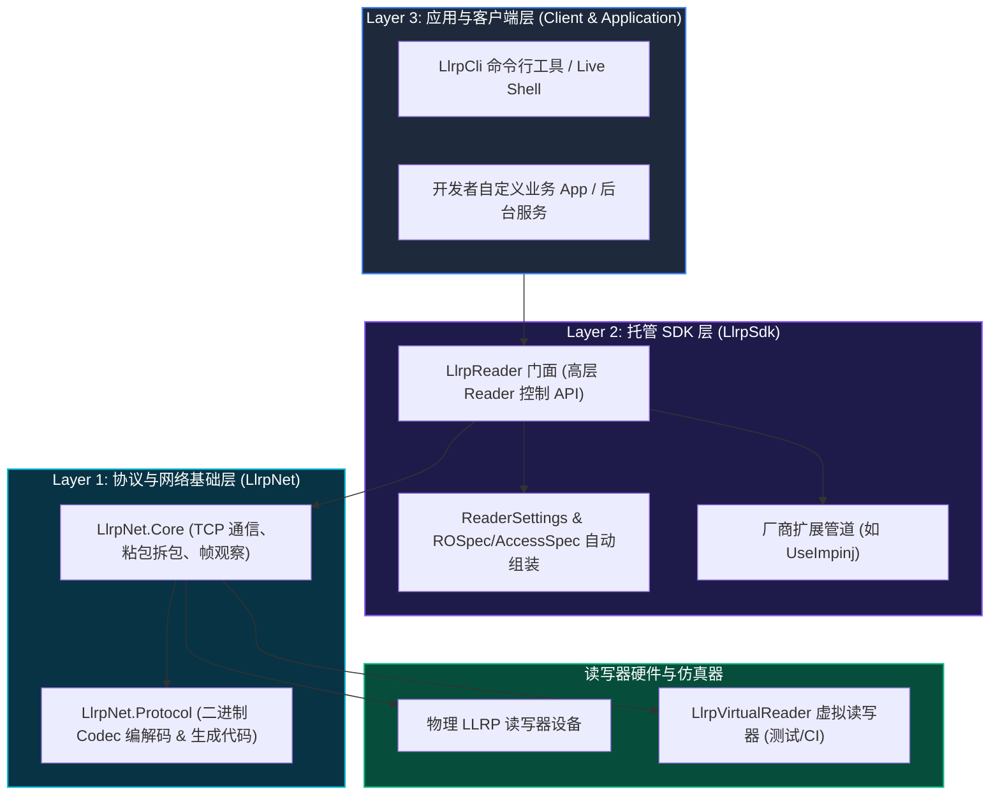

# LLRPCSharp

[English](README.md)


**LLRPCSharp** 是面向 RFID 读写器的现代化 .NET LLRP（Low Level Reader Protocol，低层读写器协议）开发包与工具链。

它对传统 LTK.NET 思路进行了现代化改造，基于最新 **.NET 10.0** 目标框架与 C# 12 特性构建，将协议代码生成、二进制编解码、异步传输、读写器状态机以及应用工作流拆分为高度解耦的清晰层次。

---

## 🏛️ 系统架构

LLRPCSharp 采用明确的三层架构，开发者可以根据具体需求直接接入协议层、托管 SDK 层或 CLI 操作工具：


<details>
<summary><b>查看原生 Mermaid 架构图</b></summary>



</details>

### 💡 三层架构详解

#### 1. Layer 3 · 应用与客户端层 (Client & Application Layer)
* **`LlrpCli` 命令行工具**：开箱即用的 Live Shell 交互终端，适合运维人员、现场调试和 Agent 自动化脚本。
* **自定义业务应用**：开发者基于 `LlrpSdk` 开发的 RFID 业务上位机、微服务或后台采集程序。

#### 2. Layer 2 · 托管 SDK 层 (Managed SDK Layer — `LlrpSdk`)
* **解决痛点**：传统的底层 LLRP 协议需要手动构建极度繁琐的 `ROSpec`（盘点规则）、`AccessSpec`（标签读写规则）等二进制参数。`LlrpSdk` 完全隐藏了这些底层细节。
* **`LlrpReader` 设备门面**：代表一台独立的读写器设备，提供 `ConnectAsync()`（自动版本协商）、`ApplySettingsAsync()`（一键配置天线/功率/Session）、`StartInventoryAsync()`（开启盘点）等简单直观的方法。
* **状态托管与报告翻译**：自动管理读写器状态机，并将底层传回的二进制 `RO_ACCESS_REPORT` 报文自动翻译为简洁的 `TagReport` 数据流（包含 EPC、天线 ID、RSSI、读次数、相位等），支持链式挂载 Impinj 等厂商专属扩展（`UseImpinj()`）。

#### 3. Layer 1 · 协议与网络基础层 (Protocol & Networking Layer — `LlrpNet`)
* **核心职责**：负责 **LLRP 二进制协议编解码** 与 **TCP 网络通信**。
* **`LlrpNet.Core` (网络传输)**：负责 TCP 通信连接生命周期、二进制字节流的粘包与拆包、请求/响应事务匹配（Transaction Matcher）以及原始帧观察器（Frame Observer）。
* **`LlrpNet.Protocol` (协议编解码)**：包含完整的 LLRP 强类型报文与参数模型、编解码注册表（`LlrpCodecRegistry`），以及通过机器可读定义（XML/YAML）自动生成的协议代码 (`.g.cs`)，实现 C# 报文对象与二进制字节流的高性能转换。

#### 底座 · 读写器硬件与仿真器 (Devices & Simulators)
* **物理 LLRP 读写器**：如 Impinj、Seuic 等支持标准 LLRP 协议的 RFID 硬件设备。
* **`LlrpVirtualReader` 虚拟读写器**：内置在内存中的模拟器，无需真实硬件即可完整模拟连接协商与标签数据推送，专门用于单元测试与 CI/CD 自动化集成。

---

## ⚡ 托管读写器工作流与生命周期

下图展示了从建立连接、协商协议版本、下发配置到启动盘点并接收异步标签报告流的完整托管生命周期：

```mermaid
sequenceDiagram
    autonumber
    actor App as 开发者应用 / CLI
    participant Reader as LlrpReader (SDK)
    participant Protocol as LlrpNet 协议与网络层
    participant Hardware as LLRP 读写器硬件

    App->>Reader: ConnectAsync()
    Reader->>Hardware: TCP 连接与协议协商 (1.0.1 / 1.1)
    Hardware-->>Reader: 连接成功与能力响应

    App->>Reader: ApplySettingsAsync(settings)
    Reader->>Protocol: 编译 ROSpec / AccessSpec
    Protocol->>Hardware: 发送 ADD_ROSPEC / ENABLE_ROSPEC
    Hardware-->>Reader: 响应配置成功

    App->>Reader: StartInventoryAsync()
    Reader->>Hardware: 发送 START_ROSPEC
    Reader-->>App: 返回 InventorySession 句柄

    rect rgb(15, 23, 42)
        note over Reader, Hardware: 异步标签报告数据流
        Hardware-->>Protocol: RO_ACCESS_REPORT (二进制协议帧)
        Protocol-->>App: yield return TagReport (EPC, RSSI, 天线, 相位)
    end

    App->>Reader: DisposeAsync() / StopInventoryAsync()
    Reader->>Hardware: STOP_ROSPEC & 关闭连接
```


<details>
<summary><b>查看原生 Mermaid 时序图</b></summary>



</details>

---

## 📋 协议与厂商扩展支持矩阵

| 能力模块 | 状态 | 详细说明 |
| :--- | :--- | :--- |
| **LLRP 1.0.1** | ✅ 完全可用 | SDK、CLI、Virtual Reader 以及主要标准 ROSpec/AccessSpec 资源与标签操作完整覆盖。 |
| **LLRP 1.1** | ✅ 基线可用 | 支持协议协商、强制版本策略（`Force11`）以及对应 Adapter 映射。 |
| **LLRP 2.0** | 🟡 预留架构 | 已引入机器可读定义 Delta，Adapter 正在规划中。 |
| **Impinj 扩展** | ✅ 主线可用 | 提供强类型 `UseImpinj()` 链式扩展、自定义 Settings 和 TagReport 数据管道。 |

---

## 💡 快速开始示例

### 托管 SDK (`LlrpSdk`)

```csharp
using LlrpSdk.Reader;
using LlrpSdk.Settings;
using LlrpSdk.Model;

// 1. 构建并连接读写器
await using LlrpReader reader = LlrpReader.CreateBuilder("192.0.2.10")
    .UseImpinj() // 启用 Impinj 厂商扩展（可选）
    .Build();

await reader.ConnectAsync();

// 2. 获取读写器默认配置，并修改常用参数（天线、功率、Session、Mode、预估标签数）
ReaderSettings defaultSettings = (await reader.GetDefaultSettingsAsync()).Settings;

ReaderSettings customSettings = defaultSettings.Edit(builder => builder
    .Inventory(inventory => inventory
        .Antennas(1, 2)             // 启用 1、2 号天线
        .Session(2)                 // 设置 Gen2 Session = 2 (0~3)
        .Population(128)            // 盘点区域预估标签数量 Population
        .Mode(modeIndex: 1000)      // 射频模式 Mode Index
        .ReportEveryTag())          // 实时上报每个标签
    .Configuration(config => config with
    {
        // 针对各天线单独设置发射功率索引 (TransmitPowerIndex) 与接收灵敏度
        Antennas = [
            new AntennaConfigurationSettings { AntennaId = 1, TransmitPowerIndex = 81 }, // 例如对应 30 dBm
            new AntennaConfigurationSettings { AntennaId = 2, TransmitPowerIndex = 81 }
        ]
    }));

// 3. 校验并下发配置
await reader.ApplySettingsAsync(customSettings);

// 4. 启动托管盘点会话并消费标签报告流
await using InventorySession session = await reader.StartInventoryAsync();
await foreach (TagReport report in session.ReadReportsAsync())
{
    Console.WriteLine($"[天线 {report.AntennaId}] EPC: {report.EpcHex} | RSSI: {report.PeakRssi} dBm");
}
```

---

## 🛠️ CLI 命令行工具 (`LlrpCli`)

启动 Live Shell 交互式终端：

```powershell
dotnet run --project src/LlrpCli
```

### Live Shell 常用流程

```text
connect 192.0.2.10
settings edit --from generic
settings show draft
settings apply --yes
inventory start
inventory status
inventory stop
```

面向 Agent 和脚本的一次性盘点命令：

```powershell
dotnet run --project src/LlrpCli -- inventory 192.0.2.10 --duration 10 --yes
```

---

## 🏗️ 构建与测试

在仓库根目录下运行 PowerShell 命令进行构建与测试：

```powershell
dotnet build LLRPCSharp.slnx --no-restore
dotnet test LLRPCSharp.slnx --no-build
```

---

## 📁 仓库结构

```text
definitions/   机器可读协议定义（XML/YAML）与厂商扩展模型
docs/          架构说明、用户指南、状态事实、路线图与 ADR
references/    LLRP 标准规范原文、抓包数据与旧项目参考
src/LlrpNet/   协议编解码、传输、代码生成器与 Impinj 协议资产
src/LlrpSdk/   托管 Reader SDK、配置模型与厂商扩展管道
src/LlrpCli/   Live Shell 交互终端与一次性命令行操作工具
tests/         单元测试、集成测试与设备互操作测试集
tools/         定义导入、校验、代码生成与测试辅助工具
```

---

## 📚 文档入口

- [当前实现状态](docs/status.md)：已实现的能力事实与已知缺口。
- [SDK API 指南](docs/guides/sdk-api-guide.md)：`LlrpReader` 托管 SDK 详细使用说明。
- [CLI 用户指南](docs/guides/cli-user-guide.md)：Live Shell 与命令行操作手册。
- [架构说明](docs/architecture/overview.zh.md)：长期架构设计原则与模块边界。
- [路线图](docs/roadmap.md)：计划工作与开发优先级顺序。
- [协议定义说明](definitions/README.md)：XML/YAML 定义与代码生成工作流。
