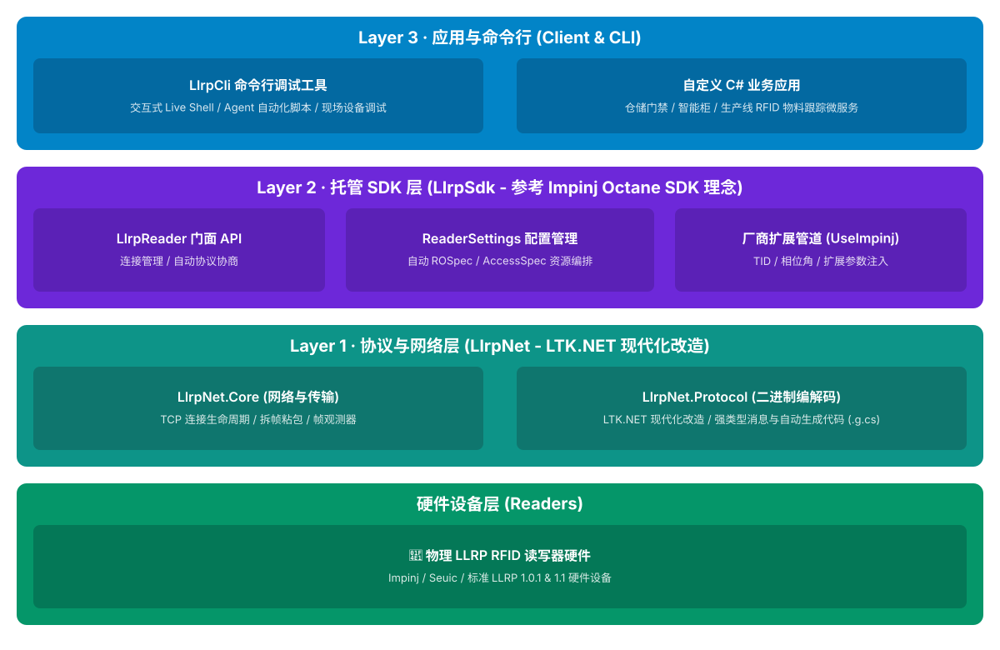

# LLRPCSharp

[English](README.md)

LLRPCSharp 是一套面向现代 .NET 的 LLRP RFID 读写器开发工具。它的主产品是 **LlrpSdk**：一个管理连接生命周期、能力发现、设置、盘存、标签报告和标准 C1G2 Tag Access 的托管 Reader API。

仓库还包含底层协议栈、可选厂商扩展、客户端与设备端命令行工具，以及确定性的 TCP/LLRP 虚拟读写器。这些组件共享同一套协议基础，同时严格分离客户端和设备端职责。

## 应该选择哪个入口

| 你的目标 | 使用 |
|---|---|
| 构建控制真实 LLRP 读写器的应用 | **LlrpSdk** |
| 启用强类型 Impinj 或 Zebra 能力 | **LlrpSdk.Extensions.Impinj** 或 **LlrpSdk.Extensions.Zebra** |
| 发送精确报文、检查帧或直接使用生成协议类型 | **LlrpNet.Core** 和 **LlrpNet.Protocol** |
| 在终端操作或诊断读写器 | **LlrpCli** |
| 为测试或 UI 开发托管一个确定性的 Reader 端点 | **LlrpDevice.Virtual.Hosting** |
| 以独立进程运行该虚拟端点 | **LlrpVirtualDevice.Cli** |

## SDK 提供什么

### 托管 Reader API

一个 **LlrpReader** 代表一台读写器连接。它负责协议协商、初始化、底层 Session、Keepalive、未请求消息处理和扩展激活。

普通应用主要使用版本中立模型：

- **ReaderCapabilities** 和 **ReaderIdentity** 表示设备事实；
- **ReaderSettings** 和 **InventorySettings** 表达配置意图；
- **InventorySession** 和 **TagReport** 提供流式标签观测；
- 高层 Read、Write、Lock、Kill 和 Block Erase 请求执行标准 Tag Access；
- 连接、操作、资源、错误、GPI、天线和缓冲区事件。

LLRP 1.0.1、1.1 和 2.0 的差异被收敛在协议适配器之后。普通业务代码不需要接触按版本生成的 Message 或 Parameter 类型。

### 三层控制面

LLRPCSharp 提供三个逐级下沉的控制层：

1. **高层操作**——使用 SDK 领域模型完成设置、托管盘存、报告和 Tag Access。
2. **专家资源**——通过 **reader.RoSpecs** 和 **reader.AccessSpecs** 显式操作 ROSpec 与 AccessSpec。
3. **Raw 协议**——通过 **reader.Protocol** 执行强类型或精确帧事务，或者直接使用 LlrpNet。

托管盘存独占 SDK 的资源域。手动资源写入必须显式进入 Manual 模式。Raw 协议访问会使 SDK 的托管状态假设失效，因此回到高层操作前必须同步状态，或者显式执行一次新的托管接管。

## 快速开始

要求：

- .NET 10 SDK；
- 一台 TCP 可达的 LLRP 读写器，默认端口通常为 5084。

安装核心包：

~~~powershell
dotnet add package LlrpSdk
~~~

连接、启动盘存、读取一条报告并停止：

~~~csharp
using LlrpSdk;

await using LlrpReader reader = LlrpReader
    .CreateBuilder("192.168.1.100")
    .Build();

await reader.ConnectAsync();

InventorySettings settings = new InventorySettingsBuilder()
    .Antennas(1)
    .ReportEvery(1)
    .Build();

await using InventorySession inventory =
    await reader.StartInventoryAsync(settings);

await foreach (TagReport report in inventory.ReadReportsAsync())
{
    Console.WriteLine(
        $"EPC={report.EpcHex} Antenna={report.AntennaId} RSSI={report.PeakRssi}");
    break;
}

await reader.StopAsync();
~~~

如果需要根据设备能力生成默认值，并采用“部署后再启动”的两段式流程：

~~~csharp
ReaderSettingsDefaults defaults = await reader.GetDefaultSettingsAsync();
await reader.ApplySettingsAsync(defaults.Settings); // 只部署，不启动

await using InventorySession inventory = await reader.StartInventoryAsync();
~~~

需要读取设备当前真实配置时使用 **QuerySettingsAsync**；它与 SDK 生成的默认 Profile 不是同一个概念。

### Impinj 扩展

~~~powershell
dotnet add package LlrpSdk.Extensions.Impinj
~~~

~~~csharp
using LlrpSdk;
using LlrpSdk.Extensions.Impinj;

await using LlrpReader reader = LlrpReader
    .CreateBuilder("192.168.1.100")
    .UseImpinj()
    .Build();
~~~

扩展会在连接前注册 Impinj Codec，仅在设备身份匹配时激活，并贡献强类型设置、盘存选项和报告字段，不会把厂商类型加入核心 SDK。

## 协议与设备支持

项目明确区分软件能力和硬件验收。生成类型与虚拟设备测试通过只能证明软件路径存在，不能证明所有 Reader 型号和固件均可互操作。

| 范围 | 当前状态 |
|---|---|
| **LLRP 1.0.1** | 主线客户端与虚拟设备路径；维护中的基线设备已完成真实 Reader 工作流验收。 |
| **LLRP 1.1** | 已有生成协议、SDK Adapter、协商、CLI、虚拟 Server 和自动互操作基线；更广泛的真机覆盖仍按设备确认。 |
| **LLRP 2.0** | 已有生成协议和 Codec、SDK Adapter、Auto/Force20 协商、CLI、虚拟 Server 与自动往返覆盖；尚未完成真实 Reader 互操作验收。 |
| **Impinj** | 主线扩展路径。R420 基线覆盖连接、能力/设置、盘存、扩展报告和非破坏性 Tag Access。 |
| **Zebra** | 已有线协议包和 SDK 扩展基线。部分 FX9600 能力/配置与报告映射有真机证据，其余自定义参数仍需逐字节验证。 |
| **Seuic** | 基于标准协议路径提供设备 Profile/默认值扩展；没有独立自定义线协议包。 |
| **虚拟设备** | 确定性的 LLRP 1.0.1/1.1/2.0 端点，包含资源生命周期、报告、标准 Tag Access、故障钩子以及标准/Impinj Profile。它不模拟真实 RF 物理波形。 |

权威边界见[当前实现状态](docs/status.md)和[读写器互操作记录](docs/acceptance/reader-interoperability.md)。

## 架构

仓库分为两个产品侧：

~~~text
客户端应用
  -> LlrpSdk + LlrpSdk.Extensions.*
  -> LlrpNet.Core + LlrpNet.Protocol
  -> 真实或虚拟 LLRP 端点

设备端工具
  -> LlrpDevice.Virtual.Hosting
  -> LlrpDevice.Server + LlrpDevice.Virtual
  -> TCP/LLRP 客户端
~~~

关键边界：

- **LlrpNet.Core** 负责 TCP 传输、分帧、事务、超时/取消和帧观察。
- **LlrpNet.Protocol** 负责按版本生成的 Message、Parameter、Enum、Codec、Registry 和 Raw/Unknown 线协议值。
- **LlrpSdk** 负责面向应用的 Reader 生命周期和版本中立工作流。
- **LlrpSdk.Extensions.\*** 通过协议模块与 Reader Extension 增加厂商行为。
- **LlrpDevice.Server** 负责设备端 LLRP Session 和资源行为。
- **LlrpDevice.Virtual** 在版本中立设备合同后实现确定性设备行为。

生成协议文件是提交到仓库的构建资产，但其事实源位于 **definitions/**，并由 Importer 与 Generator 生成。不要手工修改生成的 **.g.cs** 文件。

## 命令行工具

运行客户端 CLI：

~~~powershell
dotnet run --project src/LlrpCli/LlrpCli.csproj -- --help
~~~

LlrpCli 提供交互式 Live Shell、一次性盘存和 Tag Access、设置工作流，以及离线 Encode/Decode/Inspect 工具。

以交互 Live 模式运行虚拟 Reader：

~~~powershell
dotnet run --project src/LlrpVirtualDevice.Cli/LlrpVirtualDevice.Cli.csproj -- live --config src/LlrpDevice.Virtual/config/virtual-device.example.json
~~~

虚拟设备 CLI 负责托管 Reader 端点，不会自己生成客户端请求。应使用 LlrpSdk、LlrpCli 或其他 LLRP 客户端连接并驱动它。

## 仓库结构

~~~text
src/
  LlrpNet/                         传输、协议模型、生成器和 Codec
  LlrpSdk/                         托管客户端 SDK
  LlrpSdk.Extensions.Abstractions/ 扩展合同
  LlrpSdk.Extensions.Impinj/       Impinj SDK 扩展
  LlrpSdk.Extensions.Zebra/        Zebra SDK 扩展
  LlrpSdk.Extensions.Seuic/        Seuic Profile/默认值扩展
  LlrpCli/                         客户端 CLI

  LlrpDevice.Abstractions/         版本中立设备合同
  LlrpDevice.Server/               通用设备端 LLRP Server
  LlrpDevice.Virtual/              确定性设备实现
  LlrpDevice.Virtual.Hosting/      对外虚拟设备门面
  LlrpDevice.Virtual.Impinj/       Impinj 虚拟设备 Profile
  LlrpVirtualDevice.Cli/           独立虚拟设备 CLI

definitions/                       协议定义与生成输入
docs/                              状态、架构、指南与验收记录
tests/                             单元、架构、互操作、虚拟设备和硬件测试
tools/                             实机 Smoke 与协议探针
~~~

## 构建与测试

~~~powershell
dotnet restore LLRPCSharp.slnx
dotnet build LLRPCSharp.slnx --no-restore
dotnet test LLRPCSharp.slnx --no-build
~~~

真实 Reader 验收独立于自动化测试：

~~~powershell
dotnet test tests/LlrpSdk.Hardware.Tests/LlrpSdk.Hardware.Tests.csproj
~~~

没有可达的已配置 Reader 时，硬件测试可能跳过。发布验收记录必须确认目标测试确实执行，并写入互操作文档。

## 文档

- [文档导航](docs/README.md)
- [SDK API 指南](docs/guides/sdk-api-guide.md)
- [客户端 CLI 指南](docs/guides/cli-user-guide.md)
- [Virtual Device SDK 与 CLI](docs/guides/virtual-device-cli.md)
- [架构总览](docs/architecture/overview.zh.md)
- [协议扩展指南](docs/architecture/protocol-extension-guide.zh.md)
- [当前状态](docs/status.md)
- [路线图](docs/roadmap.md)
- [测试架构与硬件验收](tests/README.md)

## 许可证

[MIT](LICENSE)
