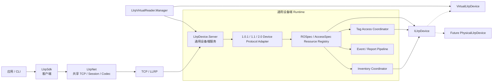

# LLRP Device Server 与 Virtual Device 下一阶段实施计划

- 状态：Implemented（本计划已完整实施并通过最终自动化验收）
- 基准日期：2026-08-17
- 实施前基线：496 项测试通过，构建 0 warning / 0 error
- 架构迁移阶段验收：508 项测试通过，0 failure / 0 skipped，构建 0 warning / 0 error；
  后续 1.0.1 设备端对齐增量验收：529 项测试通过，0 failure / 0 skipped，构建 0 warning / 0 error
- 计划入口：[路线图](../roadmap.md)

## 1. 目标

本阶段把原先以 `LlrpVirtualReader.Core` 为中心的实现重构为通用 LLRP 设备端架构：

```text
LlrpDevice.Server
    └─ ILlrpDevice
         ├─ VirtualLlrpDevice
         └─ Future PhysicalLlrpDevice
```

最终由通用 `LlrpDevice.Server` 负责 TCP/LLRP 服务、协议版本、资源状态机和报告编排；
`ILlrpDevice` 只定义设备本身能够提供的能力；`VirtualLlrpDevice` 使用假标签和确定性 RF
场景实现该合同。未来真实 RFID 模块可以实现同一个合同，不需要复制 LLRP Server、
ROSpec/AccessSpec 状态机或版本处理逻辑。

本计划完成后，Virtual Reader 是通用设备端架构的一种具体装配，不再是设备端核心层。

本计划已完成：`LlrpDevice.Server` 现在可以接入不依赖 Virtual 的脚本设备；
`VirtualLlrpDevice` 只实现设备行为合同；旧 `VirtualReaderHost` 仅作为兼容 façade
委托到新 Server。客户端 `LlrpSdk`、共享 `LlrpNet` 和协议生成资产均保持冻结。

后续的单台设备 SDK 门面与独立 CLI 已在 [ADR 0008](../adr/0008-single-virtual-device-sdk-and-cli.md)
中单独落地，不回滚本计划的完成状态。

当前目标“1.0.1 完整虚拟设备”已在本计划架构上完成：通用 Server 负责客户端 1.0.1
已使用能力的资源状态、触发器、报告 selector/缓冲、事件 Hold/Release、Keepalive、
标准 Tag Access 和连接边界；Virtual 负责确定性标签、内存和 RF 可观察行为。详细对齐
表见 [LLRP 1.0.1 设备端对齐完成度](../coverage/llrp101-device-server-coverage.md)。

## 2. 强制范围约束

### 2.1 冻结区域

本阶段不得修改以下产品代码：

- `src/LlrpNet/**`
- `src/LlrpSdk/**`
- `src/LlrpSdk.Extensions.Abstractions/**`
- `src/LlrpSdk.Extensions.Impinj/**`
- `src/LlrpSdk.Extensions.Seuic/**`
- `src/LlrpSdk.Extensions.Zebra/**`
- `definitions/**`
- 所有生成的 `*.g.cs`

具体含义：

- 不修改 `LlrpReader`、客户端连接、Settings、Inventory、TagReport 或 Tag Access 行为。
- 不修改 `LlrpNet.Core` 的 Transport、Session、Frame、Observer。
- 不修改 `LlrpNet.Protocol` 的 Registry、Codec 或生成类型。
- 新设备端项目只能消费 `LlrpNet` 已有公共 API。
- 如果实施中发现必须修改冻结区域才能继续，立即停止该阶段并提交原因、调用链和影响，
  不自行扩大范围。

允许继续使用现有客户端和 `LlrpNet` 进行编译与端到端验证；测试引用不等于修改冻结区。

### 2.2 允许修改区域

- `LLRPCSharp.slnx`
- 新增的 `src/LlrpDevice.*` 项目
- `src/LlrpVirtualReader.Core/**`
- `src/LlrpVirtualReader.Manager/**`
- `src/LlrpVirtualReader/**`
- `src/LlrpCli/Commands/VirtualReaderCommand.cs`
- `src/LlrpCli/LlrpCli.csproj` 中 Virtual Reader 所需的项目引用
- 设备端、Virtual、Manager、CLI Virtual Reader 和 Interop 测试
- 本专项相关文档

`LlrpCli` 中除 `virtual-reader` 启动入口外，`connect`、`inventory`、`settings`、`tag`、
离线 Codec 等客户端命令不修改。

### 2.3 明确不做

- 不实现真实 RFID 模块驱动。
- 不模拟真实 RF 波形。
- 不新增桌面 UI。
- 不实现进程重启后的 ROSpec/AccessSpec 自动恢复。
- 不实现自动扫描配置文件或自动启动实例。
- 不提供任意原始 LLRP 报文 JSON 配方编辑器。
- 不宣称完成全部 Impinj/Zebra 设备端模拟。
- 不因重构顺带修改客户端 API、协议生成器或生成代码。
- 不自动提交 Git commit。

## 3. 目标架构



### 3.1 项目结构

```text
src/
├─ LlrpNet/                              [冻结：共享网络和协议]
├─ LlrpSdk/                              [冻结：客户端 SDK]
│
├─ LlrpDevice.Abstractions/              [新增]
│  ├─ ILlrpDevice.cs
│  └─ LlrpDeviceModels.cs
│
├─ LlrpDevice.Server/                    [新增]
│  ├─ LlrpDeviceServer.cs
│  ├─ LlrpDeviceServerOptions.cs
│  ├─ LlrpResourceRegistry.cs
│  ├─ LlrpStandard101Handler.cs
│  ├─ LlrpDeviceProtocolDispatcher.cs
│  ├─ LlrpDeviceServerProtocol.cs
│  └─ LlrpDeviceInventoryBridge.cs
│
├─ LlrpDevice.Virtual/                   [新增]
│  ├─ VirtualLlrpDevice.cs
│  ├─ VirtualDeviceOptions.cs
│  ├─ VirtualTagStore.cs
│  └─ VirtualInventoryExecution.cs
│
├─ LlrpVirtualReader.Core/               [迁移期兼容层，最终决策见阶段 9]
├─ LlrpVirtualReader.Manager/            [Virtual 实例和本地配置]
├─ LlrpVirtualReader/                    [兼容启动器]
└─ LlrpCli/                              [仅迁移 virtual-reader 启动入口]
```

### 3.2 依赖方向

```text
LlrpDevice.Abstractions
    └─ BCL only

LlrpDevice.Server
    ├─ LlrpDevice.Abstractions
    ├─ LlrpNet.Core
    └─ LlrpNet.Protocol

LlrpDevice.Virtual
    └─ LlrpDevice.Abstractions

LlrpVirtualReader.Manager
    ├─ LlrpDevice.Server
    └─ LlrpDevice.Virtual

未来真实设备程序
    ├─ LlrpDevice.Server
    └─ LlrpDevice.<Hardware>
```

强制规则：

- `LlrpDevice.Server` 不引用 `LlrpDevice.Virtual`。
- `LlrpDevice.Virtual` 不引用 Server 内部 Runtime 类型。
- `LlrpDevice.Abstractions` 不引用 `LlrpNet.Protocol`、`LlrpSdk` 或任何 `Virtual*` 项目。
- Manager 是 Server 与 Virtual 的组合根，不把实例目录放入 Server。

## 4. 命名迁移

| 当前名称 | 目标名称 | 最终归属 |
|---|---|---|
| `ILlrpReaderDeviceBackend` | `ILlrpDevice` | `LlrpDevice.Abstractions` |
| `ILlrpReaderInventoryBackend` | `IInventoryExecution` | `LlrpDevice.Abstractions` |
| `VirtualReaderDeviceBackend` | `VirtualLlrpDevice` | `LlrpDevice.Virtual` |
| `VirtualReaderInventoryBackend` | `VirtualInventoryExecution` | `LlrpDevice.Virtual` |
| `VirtualReaderHost` | `LlrpDeviceServer` | `LlrpDevice.Server` |
| `VirtualReaderDeviceState` | `LlrpResourceRegistry` + 配置状态 | `LlrpDevice.Server.Runtime` |
| `IVirtualReaderProtocolModule` | `ILlrpDeviceProtocolModule` | `LlrpDevice.Server.Extensions` |
| `IVirtualReaderMessageHandler` | `ILlrpDeviceMessageHandler` | `LlrpDevice.Server.Extensions` |
| `VirtualReaderProtocolDispatcher` | `LlrpDeviceProtocolDispatcher` | `LlrpDevice.Server.Protocol` |
| `VirtualReaderOptions` | `LlrpDeviceServerOptions` + `VirtualDeviceOptions` | Server + Virtual |

迁移期间允许旧名称作为薄包装存在，但新业务逻辑只能进入目标项目和目标名称。

## 5. 设备合同

已落地合同：

```csharp
public interface ILlrpDevice : IAsyncDisposable
{
    LlrpDeviceIdentity Identity { get; }
    LlrpDeviceCapabilities Capabilities { get; }
    LlrpDeviceConfiguration Configuration { get; }

    event EventHandler<LlrpDeviceEvent>? EventRaised;

    ValueTask<LlrpDeviceOperationResult> ApplyConfigurationAsync(
        LlrpDeviceConfigurationUpdate update,
        CancellationToken cancellationToken = default);

    ValueTask<IInventoryExecution> StartInventoryAsync(
        LlrpInventoryPlan plan,
        CancellationToken cancellationToken = default);

    ValueTask<IReadOnlyList<LlrpTagAccessResult>> ExecuteTagAccessAsync(
        LlrpTagAccessRequest request,
        CancellationToken cancellationToken = default);
}

public interface IInventoryExecution : IAsyncDisposable
{
    LlrpInventoryPlan Plan { get; }

    ValueTask<InventoryObservationBatch> ObserveAsync(
        LlrpInventoryRound round,
        CancellationToken cancellationToken = default);

    ValueTask StopAsync(CancellationToken cancellationToken = default);
}
```

实现后的合同保持以下性质：

- 不出现 `VirtualReaderOptions`、`VirtualTag`、`VirtualReaderInventoryRound`。
- 不出现 `V1_0_1.ROSpec`、`V1_1.AccessSpec` 等生成协议类型。
- 所有可能访问真实硬件的操作为异步并接收 `CancellationToken`。
- 通过 `LlrpDeviceOperationResult`、`LlrpDeviceError` 和
  `LlrpTagAccessResultCode` 传递结构化设备失败，不以单一 `bool` 混合表示。
- Server 负责把设备结果映射为对应版本的 LLRP StatusCode。
- Server 负责把设备结果映射为对应版本的 LLRP StatusCode。

## 6. 状态与行为归属

| 能力 | 归属 | 说明 |
|---|---|---|
| TCP Listener、Session、组帧 | Server | 使用现有 `LlrpNet` 公共 API |
| 版本识别与协商 | Server Protocol Adapter | 1.0.1/1.1/2.0 显式处理 |
| ROSpec/AccessSpec 图 | Server Runtime | 不进入 `ILlrpDevice` |
| ROSpec 状态迁移 | Server Runtime | Disabled/Inactive/Active |
| KEEPALIVE、ReportSpec | Server Runtime | LLRP 服务语义 |
| Reader Event 订阅 | Server Runtime | 设备事件由 `ILlrpDevice.EventRaised` 提供 |
| ROSpec → `InventoryPlan` | Inventory Coordinator | 版本中立计划 |
| 实际寻卡 | `ILlrpDevice` | Virtual 或未来硬件实现 |
| Tag Access | `ILlrpDevice` | 设备实现执行，Server 编排 AccessSpec |
| `TagObservation` → Report | Server Report Pipeline | Adapter 输出对应线级类型 |
| 假标签、假内存、RF 场景 | Virtual | 不进入通用 Server |
| Virtual 实例目录、本地 JSON | Manager | 不进入 Server |
| 运行时持久化/自动恢复 | 本阶段不实现 | 未来如需应单独定义 Store |

## 7. Virtual 设备完整实现范围

本计划中的“完整”是指覆盖项目当前支持并需要设备端闭环的标准工作流，不等于实现标准中
所有可选消息或未经验证的厂商行为。

### 7.1 必须具备

- TCP 连接、断开、连接上限和连接隔离。
- LLRP 1.0.1 标准设备端闭环。
- LLRP 1.1 协商和已支持标准消息闭环。
- 保持现有 LLRP 2.0 Device Adapter 基线不回退；稳定 preset 必须等专项测试后再公开。
- Reader Event 初始化。
- Reader Capabilities 查询。
- Reader Config 查询、应用和 Factory Reset 语义。
- 天线配置和 GPO 状态。
- ROSpec Add/Get/Delete/Enable/Disable/Start/Stop。
- AccessSpec Add/Get/Delete/Enable/Disable。
- KEEPALIVE/ACK、CLOSE_CONNECTION、ERROR_MESSAGE。
- RO_ACCESS_REPORT 和版本正确的 TagReportData。
- EPC、TID、AntennaId、ChannelIndex、RSSI、User memory。
- 按 AISpec AntennaIds 过滤观察结果。
- `static`、`moving-tags`、`noisy` 三种确定性 RF 可观察场景。
- Seed、检测概率、RSSI 抖动、presence window、每轮最大标签数。
- C1G2 Read、Write、Lock、Kill、BlockErase 虚拟语义。
- 标签锁定状态、Killed 状态和内存变化在后续轮次保持。
- 丢响应、状态错误、主动断开、截断响应等现有故障场景。
- 本地 JSON Reader/寻卡 preset。
- 显式 validate/list/start CLI 和 Manager 行为。
- 多实例的端点、资源、标签、内存、随机场景完全隔离。

### 7.2 不宣称完成

- 真实天线、电磁传播或模拟 RF 波形。
- 真实模块吞吐、时序或区域法规行为。
- 全部 LLRP 可选消息。
- 未经抓包或资料验证的厂商扩展。
- 真实设备兼容性证据。

## 8. 分阶段实施

每个阶段必须独立编译和测试；不得累计多个破坏性迁移后再统一修复。

### 阶段 0：冻结和记录基线

任务：

1. 保留当前工作区修改，不执行 reset、checkout 或覆盖。
2. 记录当前 496 项测试和 0 warning / 0 error 基线。
3. 记录当前 CLI、Manager、Host、Interop 可观察行为。
4. 增加/修订 ADR，明确通用 Device Server 决策与冻结边界。
5. 建立当前公共类型和调用方清单。

阶段验收：

- 全量构建测试通过。
- 当前行为清单与本计划一致。
- 未修改冻结区域。

### 阶段 1：建立项目骨架和依赖守护

任务：

1. 新建 `LlrpDevice.Abstractions`。
2. 新建 `LlrpDevice.Server`。
3. 新建 `LlrpDevice.Virtual`。
4. 新建对应测试项目并加入 `LLRPCSharp.slnx`。
5. 添加项目依赖架构测试。
6. 项目只建立最小骨架，不移动业务行为。

阶段验收：

- 新项目在空实现状态下构建通过。
- Server 不引用 Virtual。
- Abstractions 只使用 BCL。
- 原有测试全部通过。

### 阶段 2：定义版本中立设备模型

任务：

1. 定义 `ILlrpDevice` 和 `IInventoryExecution`。
2. 定义 Identity、Capabilities、Configuration 模型。
3. 定义 InventoryPlan、TagSelector、TagObservation。
4. 定义 Tag Access 请求、操作和结果模型。
5. 定义 DeviceEvent 和结构化错误模型。
6. 明确每个模型的不可变性、所有权和集合复制规则。
7. 添加模型校验和合同测试。

阶段验收：

- Abstractions 不包含 `Virtual` 命名。
- Abstractions 不引用任何版本化协议命名空间。
- 所有硬件候选操作可异步取消。
- 错误模型可以无损映射当前标准 Handler 的成功/失败路径。

### 阶段 3：抽取通用 Server Host

任务：

1. 从 `VirtualReaderHost` 抽取 Listener 和生命周期到 `LlrpDeviceServer`。
2. 抽取 accepted connection、Session、ClientInfo 和 connection limit。
3. 抽取 Frame Observer、日志、消息观察事件。
4. 抽取 Dispatcher、Handler Registry 和 Protocol Module 合同。
5. 保持现有端点严格绑定和端口占用失败行为。
6. 使用测试 `ScriptedLlrpDevice` 启动 Server，证明不依赖 Virtual。
7. 在迁移期让旧 Host 委托新 Server，而不是复制实现。

阶段验收：

- Server 可使用非 Virtual 测试设备启动。
- 端点、生命周期、多连接测试通过。
- Server 产品代码不存在 `Virtual` 依赖。
- 旧入口行为无回退。

### 阶段 4：抽取通用资源状态机

任务：

1. 将 ROSpec/AccessSpec 图移入 `LlrpResourceRegistry`。
2. 抽取 ReaderConfigurationState。
3. 抽取 ROSpec 和 AccessSpec 状态迁移。
4. 保持 id=0 删除全部资源语义。
5. 保持 ROSpec 删除时关联 AccessSpec 清理语义。
6. 把 Keepalive、ROReportSpec、AccessReportSpec、EventsAndReports 收归 Server。
7. 从设备合同删除所有 ROSpec/AccessSpec CRUD 方法。

阶段验收：

- 更换 `ILlrpDevice` 实现不会改变资源状态机结果。
- 合法和非法状态迁移均有专项测试。
- `ILlrpDevice` 不暴露协议资源类型。
- 1.0.1/1.1 现有资源 Interop 测试通过。

### 阶段 5：建立设备端版本 Adapter

任务：

1. 定义 `ILlrpDeviceProtocolAdapter`。
2. 将 1.0.1 标准 Handler 收敛到 V101 Adapter。
3. 将 1.1 negotiation/translation 收敛到 V11 Adapter。
4. 保留并隔离 V20 Adapter 基线。
5. Adapter 把 Wire ROSpec 编译成版本中立 InventoryPlan。
6. Adapter 把 AccessSpec 编译成版本中立 TagAccessRequest。
7. Adapter 把 DeviceResult 映射为版本正确的 LLRP Status。
8. Adapter 把 TagObservation 构造为版本正确的 TagReportData。
9. 增加版本命名空间架构守护。

迁移期间允许 V1.0.1 canonical 类型短暂留在 Server 的协议实现内部，但最终不得出现在
Abstractions 或 Virtual 中。

阶段验收：

- 1.0.1/1.1 wire 输出和状态行为等价。
- 2.0 当前测试基线不回退。
- 版本化生成类型只出现在 Server Protocol Adapter 范围。
- 不修改任何生成代码。

### 阶段 6：实现 VirtualLlrpDevice

任务：

1. 把固定标签源迁移为 `VirtualTagStore`。
2. 把标签定义与观察结果分开。
3. 实现 Virtual Device identity、capabilities、configuration。
4. 实现 `VirtualInventoryEngine` 和异步 InventoryExecution。
5. 将 RF 场景拆为可替换策略。
6. 支持天线过滤、最大标签数和确定性顺序。
7. 实现标签内存和 Access 密码状态。
8. 实现 Read、Write、Lock、Kill、BlockErase。
9. Kill 后标签不再出现在盘点结果。
10. 锁定后非法写操作返回结构化失败。
11. 每个实例拥有独立标签状态和随机场景状态。

阶段验收：

- 同 seed/同输入逐轮输出一致。
- Moving 场景按 presence window 重复变化。
- Noisy 场景检测率和 RSSI 在配置范围内。
- Tag Access 修改可在后续读取和报告中观察。
- 两个 Virtual 实例互不污染。
- Virtual 项目不引用 Server 内部状态机。

### 阶段 7：迁移故障和扩展管道

任务：

1. 将网络/协议故障定义为 Server Middleware 或测试 Hook。
2. 保留 Drop response、Status error、Disconnect、Truncate 行为。
3. 将 Virtual fault preset 变为 Middleware 的组合配置。
4. 将协议模块接口改为 `ILlrpDeviceProtocolModule`。
5. 将设备端 Handler 接口改为 `ILlrpDeviceMessageHandler`。
6. 保持 Codec 注册发生在 Listener 启动前。
7. 保持自定义 Handler 优先于标准 Handler。

阶段验收：

- SDK timeout、status error、reconnect、truncated frame 测试继续通过。
- 故障注入不进入 `ILlrpDevice` 合同。
- 第三方设备端 Handler 不依赖 Virtual 项目。

### 阶段 8：迁移 Manager、本地配置和 CLI

目标组合：

```csharp
ILlrpDevice device = new VirtualLlrpDevice(virtualOptions);
await using var server = new LlrpDeviceServer(serverOptions, device);
```

任务：

1. 将 Host 配置拆为 `LlrpDeviceServerOptions` 和 `VirtualDeviceOptions`。
2. Manager 同时构造 Server 和 Virtual Device。
3. 保持实例 ID、Preset ID、端点和生命周期 API。
4. 保持本地 JSON schema 1 的兼容读取；只有字段形态变化才升级 schema。
5. 将 JSON 字段映射到拆分后的两组选项。
6. 保持内置和本地 preset 可同时引用。
7. 保持 `--validate-config` 不绑定端口。
8. 保持 `--list-presets` 不启动实例。
9. 保持 `--config --instance` 显式启动。
10. 只修改 CLI 的 `virtual-reader` 命令和必要项目引用。

阶段验收：

- 当前示例 JSON 继续通过校验。
- CLI/Manager validate/list/start 冒烟通过。
- 多实例 create/start/stop/restart/delete 行为保持。
- CLI 客户端命令无代码变化。
- 不自动恢复上次运行状态。

### 阶段 9：兼容层和旧项目收口

任务：

1. 迁移期间保留 `VirtualReaderHost`、`VirtualReaderOptions`、
   `VirtualReaderHostOptions` 的薄包装。
2. 旧包装只负责参数映射和委托，不保留状态机、协议 Handler、标签逻辑。
3. 将仓库内 Manager、CLI、Interop 调用迁移到新项目。
4. 使用 `rg` 确认没有新代码继续引用旧 Core API。
5. 根据发布兼容责任决定：
   - 无外部兼容责任：从 solution 移除旧 Core；
   - 需要兼容：保留非业务 façade，并标注迁移入口。

阶段验收：

- 仓库主路径只使用新架构。
- 不存在新旧两套状态机或报告调度器。
- 兼容层可以单独删除而不影响新 Server/Virtual 项目。

### 阶段 10：测试和架构门禁

新增或迁移：

- `LlrpDevice.Abstractions.Tests`
- `LlrpDevice.Server.Tests`
- `LlrpDevice.Virtual.Tests`
- Manager 配置和生命周期测试
- CLI Virtual Reader 测试
- SDK ↔ Device Server Interop 测试
- `ScriptedLlrpDevice` 合同测试
- 1.0.1/1.1 双版本等价测试
- 2.0 基线测试
- Tag Access Read/Write/Lock/Kill/BlockErase 测试
- RF 场景确定性测试
- 项目引用和版本类型架构守护测试

门禁：

- 原 496 项测试不得无解释丢失。
- 被迁移测试必须有等价或更强的新断言。
- 0 failure、0 skipped。
- Build 0 warning、0 error。
- Server 无 Virtual 引用。
- Abstractions 无生成协议类型引用。
- 冻结区域无产品代码 diff。
- 生成 `*.g.cs` 无 diff。

### 阶段 11：文档和最终验收

更新：

- 新设备端 ADR。
- `docs/status.md`。
- `docs/roadmap.md`。
- `docs/architecture/overview.md` / `overview.zh.md`。
- `docs/architecture/source-structure.md`。
- Virtual Reader Manager guide。
- README/README.zh Virtual Reader 部分。
- `tests/README.md`。

最终验证：

```powershell
dotnet build LLRPCSharp.slnx --no-restore
dotnet test LLRPCSharp.slnx --no-build
```

并执行：

- `git diff --check`
- 冻结目录 diff 审计
- 生成 `*.g.cs` diff 审计
- CLI `virtual-reader --help`
- JSON validate/list 冒烟
- Virtual Reader TCP 启动
- SDK 1.0.1/1.1 端到端盘点
- 标准 Tag Access 全操作回归
- 两个 Virtual 实例隔离验证
- `ScriptedLlrpDevice` 替换验证

## 9. 实施期间的回归策略

- 每个阶段结束后运行对应项目测试，再运行全量测试。
- 不跨阶段积累编译错误。
- 不通过复制旧实现建立第二套长期并行逻辑。
- 先委托、再迁移、最后删除旧实现。
- 发生行为差异时，以当前 496-test 基线和 `docs/status.md` 的已实现事实为准。
- 如果新架构要求客户端或 `LlrpNet` 配合修改，阶段立即暂停并单独评审，不在本计划内处理。

## 10. 最终完成判定

必须全部满足：

1. `LlrpDevice.Server` 可以使用非 Virtual 的 `ScriptedLlrpDevice` 独立运行。
2. `VirtualLlrpDevice` 只实现 `ILlrpDevice`，不拥有 LLRP 资源状态机。
3. ROSpec、AccessSpec、Keepalive、ReportSpec 由通用 Server Runtime 管理。
4. Server 不引用 Virtual。
5. Abstractions 不引用生成协议类型、SDK、Manager 或 Virtual。
6. Virtual 完成标签、确定性 RF 场景和项目标准 Tag Access 闭环。
7. Manager、CLI、本地 JSON 全部迁移到新组合方式。
8. LLRP 1.0.1/1.1 现有行为无回退。
9. LLRP 2.0 当前基线无回退。
10. 客户端产品代码无修改。
11. `LlrpNet` 产品代码无修改。
12. 生成代码无修改。
13. 全量构建 0 warning、0 error。
14. 全量自动化测试 0 failure、0 skipped。
15. UI、真实硬件和自动恢复仍保持未实现，不产生误导性状态声明。

本阶段已经从“计划中”更新为“已交付”。

## 11. 实施结果记录

本计划已按阶段完成：

| 阶段 | 结果 | 证据 |
|---|---|---|
| 0–2 | 已完成 | 冻结边界、ADR 0007、`LlrpDevice.Abstractions` 与合同测试 |
| 3–5 | 已完成 | `LlrpDevice.Server`、非 Virtual Scripted Device 测试、1.0.1/1.1 Server 互操作 |
| 6–7 | 已完成 | `VirtualLlrpDevice` RF/Tag Access/故障与隔离测试 |
| 8–9 | 已完成 | Manager/CLI 新组合路径、旧 `VirtualReaderHost` 委托 façade、旧测试回归 |
| 10 | 已完成 | 508 项测试通过，0 failure / 0 skipped，构建 0 warning / 0 error |
| 11 | 已完成 | 状态、路线图、双语架构、Manager 指南、README、测试清单已同步 |

实现边界保持原计划声明：当前仍不包含真实 RFID 驱动、模拟真实 RF 波形、桌面 UI，
也不包含进程重启后的 ROSpec/AccessSpec/托管盘点自动恢复。上述能力如需实现，应作为
独立阶段设计硬件适配器和持久化 Store，不应回写到 `ILlrpDevice` 的协议资源职责中。
