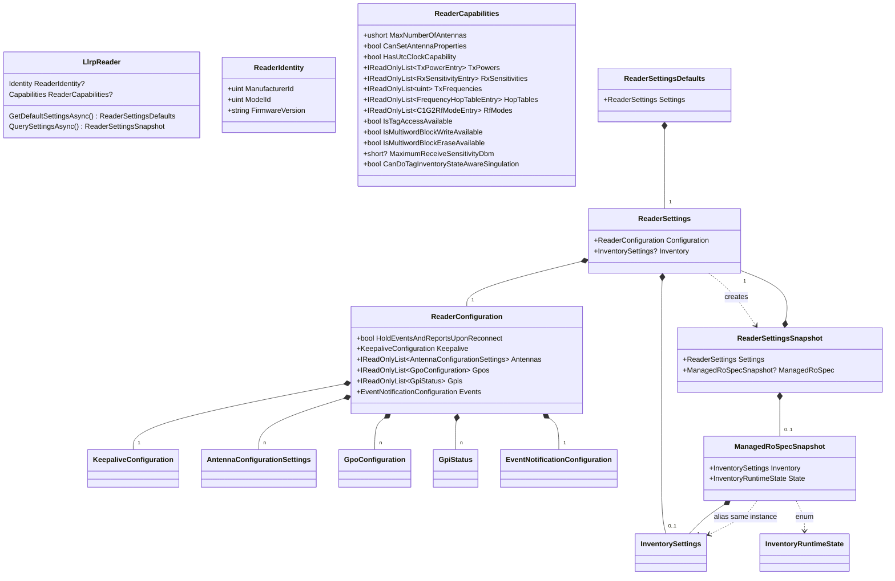

# LlrpNet 协议层 & LlrpSdk API 层 开发详解

> 面向开发人员的内部架构详解,只覆盖两层核心:
> **第一章 LlrpNet 协议层**(协议模型、编解码、传输会话)与
> **第二章 LlrpSdk API 层**(领域模型、门面 API、扩展机制)。
> 总览、路线图与多版本约定分别见 `docs/architecture/overview.md`、
> `docs/roadmap.md`、`AGENTS.md`。

---

# 第一章 LlrpNet 协议层

## 1.1 定位与项目结构

`LlrpNet` 是**协议精确层**:它忠实实现 LLRP 1.0.1 / 1.1 / 2.0 的报文结构、编解码与
传输,不含任何"设备业务"概念(没有盘点、没有标签模型)。2.0 已有独立版本类型与 SDK
Adapter 基线,真实设备互操作仍由验收记录单独确认。它由两个程序集组成:

```
LlrpNet.Protocol   协议模型与编解码(消息/参数/枚举类型 + 注册中心)
LlrpNet.Core       传输无关核心(帧、会话、事务、缓冲、诊断)
```

```
src/LlrpNet/LlrpNet.Protocol/
  Messages/        消息类型,按版本分目录:V1_0_1/、V1_1/(各自完整独立)
  Parameters/      参数类型,按版本分目录
  Enumerations/    枚举,按版本分目录
  Choices/         联合类型(例如 Timestamp 的 UTime/USec 二选一)
  Codecs/          每个生成类型的编解码器(由生成器产出)
  Registry/        注册中心:标准模块 + LlrpCodecRegistry

src/LlrpNet/LlrpNet.Core/
  Transport/       传输抽象(ILlrpTransport)+ TCP 实现
  Session/         会话:帧读写、背压、未请求帧队列
  Transactions/    请求-响应事务匹配(MessageId)
  Frames/          帧边界解码(LlrpFrameDecoder)
  Buffers/         位级读写(LlrpBitReader/Writer)——LLRP 参数按位对齐
  Diagnostics/     帧观察者(抓包/日志)
  Protocol/        LlrpMessageHeader、LlrpProtocolVersion、异常类型
```

**分工原则**:`LlrpNet.Protocol` 只关心"报文长什么样、怎么编解码";
`LlrpNet.Core` 只关心"字节流怎么传、请求怎么配对"。两者都不依赖 `LlrpSdk`。

## 1.2 生成代码架构:为什么每版本一套独立类型

### 流水线(双输入格式:官方 XML + 手写 YAML)

```
definitions/imports/xml/llrp-1.0.1/llrp-1x0-def.xml  官方 LTK XML 标准定义
definitions/imports/xml/extensions/impinj/*.xsd|xml   厂商 XML
definitions/*.yaml(1.1 / 2.0-delta / 扩展)            手写增量定义
        └──────┬──────┘
               ↓ LtkXmlDefinitionImporter / YamlProtocolDefinitionImporter
        ProtocolDefinition(统一协议模型)
               ↓ Validator + ProtocolSourceGenerator
        *.g.cs:每个消息/参数/枚举一个文件,按版本分目录
```

- **XML 与 YAML 殊途同归**:两个导入器输出**同一个 `ProtocolDefinition` 模型**,
  Validator 与 Generator 不区分输入格式(definitions/README 原话)
- 常见组合:**以官方 XML 为 base**(`--dependency .../llrp-1x0-def.xml`),
  手写 YAML 作 delta/扩展叠加
- 所有 `*.g.cs` **禁止手改**(AGENTS.md 规则):改协议 = 改 definitions → 重新生成

### 关键设计:版本 = 命名空间,类型不共享、不继承

```
V1_0_1.KEEPALIVE 和 V1_1.KEEPALIVE 是两个完全独立的 class
```

为什么这样:

1. **LLRP 1.1 是 1.0.1 的增量修订**——大部分消息相同,但新增了
   `GET_SUPPORTED_VERSION`、`C1G2XPCW1` 等,部分参数结构有调整。若共用一套
   类型,1.0.1 设备会"看到"不存在的字段。
2. **类型安全优先**:同一概念在不同版本中可能是不同结构,强类型系统下必须分开。
3. **版本可扩展**:后续版本再来一套对应的 `Vx_y` 类型即可,不共享已有版本类型(见 AGENTS.md 约定)。

代价与对策:相同的概念(`KEEPALIVE`)在类型系统里按版本各有一个 class——对策是
**注册中心按版本分派**(见 1.3),公共边界组件显式检查已支持版本的消息类型
(`V101Messages.X` / `V11Messages.X` / `V20Messages.X`)。

### 生成类型的形态(以消息为例)

```csharp
// Messages/V1_1/KEEPALIVE.g.cs(示意)
public sealed record KEEPALIVE(
    uint MessageId) : ILlrpMessage
{
    public const ushort MessageType = 30;   // 线协议类型号
    // 编解码器在 Codecs/ 目录,注册到 LlrpCodecRegistry
}
```

- 消息/参数是 **record**(值语义,`with` 便于复制修改)
- 每个类型带 `TypeNumber`/`ParameterType` 常量(线协议编号)
- 编解码器与类型分离,统一走注册中心(便于厂商扩展)

## 1.3 编解码注册中心 LlrpCodecRegistry(协议层心脏)

文件:`src/LlrpNet/LlrpNet.Protocol/Registry/LlrpCodecRegistry.cs`

### 内部结构:8 张索引

| 索引 | 键 | 值 |
|---|---|---|
| `_messageDecoders` | `MessageWireKey(Version, MessageType)` | 消息编解码器 |
| `_messageEncoders` | `ClrKey(Version, CLRType)` | 消息编解码器 |
| `_parameterDecoders` | `ParameterWireKey(Version, Encoding, ParameterType)` | 参数编解码器 |
| `_parameterEncoders` | `ClrKey(Version, CLRType)` | 参数编解码器 |
| `_customMessageDecoders` | `(Version, VendorId, Subtype)` | 厂商自定义消息 |
| `_customMessageEncoders` | `ClrKey(Version, CLRType)` | 厂商自定义消息 |
| `_customParameterDecoders` | `(Version, VendorId, ParameterSubtype)` | 厂商自定义参数 |
| `_customParameterEncoders` | `ClrKey(Version, CLRType)` | 厂商自定义参数 |

**键都含 Version**——这是双版本共存的基础:
`(Version101, 30)` 和 `(Version11, 30)` 是不同键,1.0.1 和 1.1 的
`KEEPALIVE` 编解码器可以同时注册,互不覆盖。

### 解码:自动按帧头版本分派

```csharp
public ILlrpMessage DecodeMessage(LlrpMessageHeader header, ReadOnlySpan<byte> payload)
{
    // LLRP 帧头自带 Version 字段(1.0.1=1, 1.1=2)
    MessageRegistration? registration = FindMessageDecoder(header.Version, header.MessageType);
    if (registration is null)
        return new UnknownMessage(header.Version, header.MessageType, header.MessageId, payload);
    return registration.Codec.Decode(header, payload);
}
```

要点:
- **解出什么类型由帧头 Version 决定**,调用方无需判断
- 未注册的报文 → `UnknownMessage`(保留原始字节,不抛异常)——鲁棒性设计,
  未知厂商/未来版本报文不会让连接崩溃
- 参数解码同样按 `(Version, 编码方式TV/TLV, Type)` 三键查找

### 编码:按 CLR 类型查找

```csharp
MessageRegistration? registration = FindMessageEncoder(version, message.GetType());
// 注册时同时登记了 (Version, CLRType) 键,对象类型自带版本信息
```

编码必须显式传版本(`EncodeMessage(version, message)`),与对象类型必须匹配
(CLRKey 含 Version),类型与版本错配会得到明确的 `NotSupportedException`。

### 注册规则

- 同一键重复注册 → `InvalidOperationException`(拒绝覆盖,防静默替换)
- 注册通过**模块**批量完成(见 1.4)
- `CUSTOM_MESSAGE`(1023)与自定义参数类型号被注册中心保留,走专用 API

## 1.4 模块注册:一个版本/厂商一个入口

```
V1_0_1ProtocolModule.Register(registry)    // 生成:1.0.1 全部标准消息/参数
Llrp11StandardModule.Register(registry)    // 生成:1.1 全部标准消息/参数
ImpinjProtocolModule.Instance.Register(registry)  // 厂商:Impinj 扩展
(Seuic 模块同理)
```

一个模块 = 一次性注册该版本/厂商的全部编解码器。SDK 构造 reader 时把
1.0.1 + 1.1 + 已配置厂商模块都注册进同一个 registry——双版本共存,
按帧头 Version 自动选对。

> CLI 离线工具的 1.1 缺口(`docs/roadmap.md`)正是这里漏了
> `Llrp11StandardModule.Register`。

## 1.5 Core 子模块逐个讲

### Transport:传输可替换

```csharp
public interface ILlrpTransport
{
    ValueTask ConnectAsync(...);
    ValueTask<int> ReadAsync(Memory<byte> buffer, ...);
    ValueTask WriteAsync(ReadOnlyMemory<byte> data, ...);
}
```

- `LlrpTcpTransport` 是默认 TCP 实现;接口化使未来可支持串口/蓝牙等
- SDK 测试用 `ScriptedLlrpTransport` 模拟设备(帧级脚本),不依赖真实网络

### Session:帧读写与背压

`LlrpSession` 职责:
- 建立连接后维护**读帧循环**(用 `LlrpFrameDecoder` 按帧头 MessageLength 切帧)
- **请求帧**:交给 `PendingTransactionManager`(见下),按 MessageId 匹配响应
- **未请求帧**(报告/事件/keepalive):写入独立队列,供上层(消息泵)消费
- **背压**:消费跟不上时,写侧抛 `LlrpSessionBackpressureException`;
  未请求帧队列满时按 `LlrpUnsolicitedFrameOverflowPolicy`(丢弃/阻塞)处理

### Transactions:请求-响应配对

```
发 ADD_ROSPEC(MessageId=5) → PendingTransactionManager 登记
收 ADD_ROSPEC_RESPONSE(MessageId=5) → 匹配 → 完成 Task
超时/断连 → 以异常完成
```

`LlrpMessageIdGenerator` 保证 MessageId 单调递增不重复。

### Frames 与 Buffers

- `LlrpFrameDecoder`:字节流 → 完整帧(处理粘包/半包)
- `LlrpBitReader/Writer`:**位级**读写——LLRP 参数长度以 bit 计,字段按位对齐
  (如 1-bit 标志 + 7-bit 类型 + 16-bit 长度的 TV 参数头)
- `LlrpBufferReader/Writer`:整参数字节级的读取辅助

### Diagnostics:帧观察者

`ILlrpFrameObserver` + `CompositeLlrpFrameObserver` + `LlrpFrameJournal`:
对收发帧做旁路观察(日志/抓包),不影响数据通路。CLI 的 `--monitor frames`
就是挂观察者实时打印原始帧。

## 1.6 开发人员上手:解码一个帧

```csharp
using LlrpNet.Protocol;
using LlrpNet.Protocol.Registry;
using LlrpNet.Protocol.Registry.V1_0_1;

var registry = new LlrpCodecRegistry();
V1_0_1ProtocolModule.Register(registry);

// 假设拿到一帧(十六进制)→ 解码
byte[] frame = Convert.FromHexString("043E0000000A01020304");
ILlrpMessage message = registry.DecodeMessage(frame);

if (message is UnknownMessage unknown)
    Console.WriteLine($"未知报文 type={unknown.MessageType}, 原始 {unknown.Payload.Length} 字节");
else
    Console.WriteLine($"解出 {message.GetType().Name}, MessageId={message.MessageId}");
```

---

# 第二章 LlrpSdk API 层

## 2.1 定位与三层结构

`LlrpSdk` 是**设备抽象层**:把"连一台 LLRP 读写器、配置、盘点、读写标签"
收敛成版本无关的 C# API。开发人员**只接触这一层**,不直接碰协议类型。

```
┌────────────────────────────────────────────────┐
│ 领域层(版本无关)                                 │
│   InventorySettings / ReaderSettings / TagReport │
│   ReaderCapabilities / TagAccessRequest 等       │
├────────────────────────────────────────────────┤
│ 适配层(版本相关,唯一版本边界)                     │
│   ILlrpProtocolAdapter                           │
│   ├─ Llrp101ProtocolAdapter(编译/翻译 1.0.1)     │
│   ├─ Llrp11ProtocolAdapter(编译/翻译 1.1)        │
│   └─ Llrp20ProtocolAdapter(编译/翻译 2.0)        │
├────────────────────────────────────────────────┤
│ 门面层(公共 API)                                 │
│   LlrpReader(连接/配置/盘点/标签操作/事件)         │
│   InventorySession(报告流)                       │
└────────────────────────────────────────────────┘
```

**为什么这么分层**:
- 领域类型**零协议引用**(审计确认:公共属性/枚举全部是 SDK 自有类型)——设备
  版本差异不泄漏到业务代码
- 适配器是**唯一的版本翻译点**:领域→协议(编译)与协议→领域(翻译)全部收敛于此。
  反向翻译(反解析 `ParseManagedRoSpec`)、事件投影(`Llrp101/11/20EventProjector`)、
  标准消息构造与分类(`LlrpProtocolMessageFactory`)和连接前版本协商
  (`LlrpVersionNegotiator`)都住在版本边界内;`LlrpReader` 源码零版本类型引用,
  由 `ArchitectureGuardTests` 机器强制
- 加新版本(例如 3.0)= 加一个新适配器 + 配套反解析/投影组件 + 注册模块,门面业务逻辑零改动；
  仅需在显式适配器注册接线点加入新适配器

### 2.1.1 领域模型演进:新属性从哪来

"零协议引用"承诺的是**类型不泄漏**(业务代码不出现 `V1_0_1.ROSpec` 这类协议类),
**不是**领域模型永不变化——V2.0 或厂商扩展引入新概念时,领域类型需要演进。
演进有两条路,以例子说明。

**例子 1:V2.0 官方新增属性(核心类型加属性,向后兼容)**

场景:LLRP 2.0 引入 `C1G2Challenge` 安全参数(`definitions/llrp-2.0-delta.yaml`),
`InventorySettings` 要暴露"启用挑战应答"。

```csharp
// ① 核心领域类型加属性:init + 默认值 = 向后兼容的加法
public sealed record InventorySettings
{
    // …现有属性不变…
    public bool EnableChallengeResponse { get; init; } = false;   // V2.0 新增
}

// ② 映射只在 V2_0 适配器里:"属性 ↔ 协议参数"吞在版本边界内
//    Llrp20ProtocolAdapter.CompileInventory(示意):
if (settings.EnableChallengeResponse)
    roSpec = roSpec with { Challenge = new V20Parameters.C1G2Challenge(…) };

// ③ 业务代码视角:只碰领域属性,永远见不到 V20 类型
var s = new InventorySettingsBuilder().Build() with { EnableChallengeResponse = true };
```

三个要点:
- **老设备(1.0.1/1.1)**:该属性被 101/11 适配器**忽略**,不编译进协议——属性存在但无效
- **老业务代码**:不设置 = `false` 默认值,编译零破坏
- **映射只存在于 V2_0 适配器**,不进公共逻辑

**例子 2:厂商扩展新增属性(Extensions 字典,核心类型不动)**

场景:Impinj 扩展新增 `ImpinjInventoryControlOptions`(真实代码路径:
`InventorySettingsBuilder.SetExtension` + `TryGetExtension`)。

```csharp
// ① 厂商定义自己的选项类型(独立命名空间,核心领域类型零改动)
public sealed record ImpinjInventoryControlOptions
{
    public bool EnableTagPopulationEstimation { get; init; }
    public const string ExtensionKey = "impinj.inventoryControl";  // 真实值
}

// ② 业务代码:通过 builder 扩展方法写入 Extensions 字典
var settings = new InventorySettingsBuilder()
    .SetExtension(ImpinjInventoryControlOptions.ExtensionKey, impinjControl)
    .Build();

// ③ 编译侧:厂商编译钩子读字典,映射为 Impinj 自定义参数
builder.TryGetExtension(ImpinjInventoryControlOptions.ExtensionKey, out ImpinjInventoryControlOptions? control);
```

三个要点:
- **核心 `InventorySettings` 属性面零改动**(字典是开放的,不认识就忽略)
- 编译由**厂商自己的编译管线**完成,核心 SDK 不知情
- 新旧 SDK 兼容:老 SDK 遇到未知 ExtensionKey 直接忽略

**两条路对比**

| 维度 | V2.0 官方新增 | 厂商扩展新增 |
|---|---|---|
| 属性放哪 | `InventorySettings` 加 `init` 属性 | `Extensions` 字典,核心类型不动 |
| 谁做映射 | `V2_0` 适配器 | 厂商编译钩子(ImpinjInventorySettingsBuilder 等) |
| 老设备 | 属性被忽略(不编译) | 字典条目被忽略 |
| 老 SDK | 编译仍通过(默认值) | 未知 ExtensionKey 忽略 |
| 业务代码 | 升级 SDK 后用新属性 | 引厂商包后用 builder 方法 |

判断标准:官方协议演进(如 2.0)走**例 1**(加属性,版本适配器映射);厂商/未
建模的扩展走**例 2**(字典,零核心改动)。两者都保证业务代码只接触领域类型。

## 2.2 领域模型逐个讲

### InventorySettings:盘点意图

```csharp
var settings = new InventorySettingsBuilder()
    .Antennas(1, 2)                          // 天线 1、2
    .ReportEvery(1)                          // 每 N 个标签报告一次(默认 UponNTagsOrEndOfAiSpec 触发)
    .ReadTid(words: 6)                       // 附带读取 TID(attached data)
    .Build();

// 报告细节(触发方式、包含字段)通过 with 调整:Report 是 InventoryReportSettings record
var detailed = settings with
{
    Report = settings.Report with { Trigger = InventoryReportTrigger.UponNTagsOrEndOfAiSpec },
};
```

- 表达"我要怎么盘点"的**意图模型**(不是设备配置快照——那是 ReaderSettings)
- 包含:天线、报告选项、Select 过滤器、StateAwareSingulation、
  attached-data(读 TID/自定义内存)
- 配套 `InventorySettingsSerializer`(JSON 持久化)

### ReaderSettings:完整配置

```csharp
var settings = new ReaderSettingsBuilder()
    .WithInventory(inventorySettings)
    .WithKeepalive(new KeepaliveConfiguration { IntervalMs = 5000 })
    .Build();

SettingsValidationResult result = await reader.ValidateSettingsAsync(settings);
```

- 完整配置快照:Inventory + Keepalive + GPI/GPO + 事件通知等
- `ReaderSettingsSerializer`(JSON);校验器返回结构化 `SettingsValidationResult`

### TagReport:一条标签观测

```csharp
await foreach (TagReport report in session.ReadReportsAsync(cts.Token))
{
    Console.WriteLine($"EPC={report.EpcHex} 天线={report.AntennaId} RSSI={report.PeakRssi}");
    if (report.Extensions.TryGetValue("impinj.serializedTid", out var tid))
        Console.WriteLine($"TID={report.GetSerializedTidHex()}");
}
```

- `ElectronicProductCode`(字节)+ `EpcHex`(便捷 hex 串)
- `Extensions` 字典:厂商附加字段(contributor 管道写入,见 2.6)
- 内置便捷成员:`GetSerializedTidHex()`(Impinj 扩展命名空间)

### Tag Access 请求族

`ReadTagRequest / WriteTagRequest / LockTagRequest / KillTagRequest /
BlockEraseTagRequest`,统一经 `ReadTagMemoryAsync` 等门面方法下发,结果
`TagAccessResult` 族返回操作状态。

## 2.3 LlrpReader 公共 API 使用指南

### 构建与连接

```csharp
LlrpReader reader = LlrpReader.CreateBuilder("192.168.1.100")
    .WithPort(5084)
    .WithProtocolVersionPolicy(LlrpProtocolVersionPolicy.Auto) // 默认
    .UseImpinj()          // 注册 Impinj 扩展
    .Build();

await reader.ConnectAsync(cts.Token);
```

`LlrpProtocolVersionPolicy`:
- `Auto`(默认):通过 `GET_SUPPORTED_VERSION` 探测,优先选择 2.0,其次 1.1;设备拒绝探测时保留 1.0.1
- `Force101` / `Force11` / `Force20`:锁定版本;强制版本不可用时连接失败(不静默回退)

### 事件订阅(11 个)

```csharp
reader.TagsReported += (_, e) => HandleTag(e.TagReport);
reader.KeepaliveTimedOut += (_, _) => Console.WriteLine("设备失联!");
reader.ConnectionChanged += (_, e) => Console.WriteLine($"连接: {e.NewState}");
reader.TagReportsDropped += (_, e) => Log.Warn($"报告被丢弃 {e.DroppedCount} 条");
```

常用事件:连接变化、错误、标签报告、GPI/天线变化、keepalive 超时、
reader 报告缓冲溢出/告警、SDK 连接级报告丢弃。

### 盘点(核心场景)

```csharp
await using var session = await reader.StartInventoryAsync(settings, cts.Token);
await foreach (TagReport report in session.ReadReportsAsync(cts.Token))
    Console.WriteLine(report.EpcHex);
// 或连接级全量流:
// await foreach (TagReport r in reader.ReadTagReportsAsync(cts.Token)) ...
```

- `StartInventoryAsync` 返回**单实例**会话(已有会话再启动会抛异常)
- 报告出口互斥:
  - **会话级** `session.ReadReportsAsync`:只收本会话 RoSpecId 的报告
  - **连接级** `reader.ReadTagReportsAsync` 或 `TagsReported`:所有报告
  - 同一盘点生命周期内首次消费的出口取得所有权，其他出口立即报错；Tag Access
    使用内部等待器，不会通过公开回调抢占所有权。
- 停止:session.DisposeAsync / reader.StopAsync / ClearManagedSettingsAsync

### 配置管理

```csharp
ReaderSettingsDefaults defaults = await reader.GetDefaultSettingsAsync();
await reader.ApplySettingsAsync(defaults.Settings);
ReaderSettingsSnapshot current = await reader.QuerySettingsAsync();
```

#### ReaderSettingsSnapshot 结构树(两域模型)

`QuerySettingsAsync` 一次拉取 LLRP 的两个资源域,组合成一个快照:

```
ReaderSettingsSnapshot
│
├─ Settings : ReaderSettings            ◀─ Config 域(可编辑/可回发 ApplySettingsAsync)
│   │                                      ← 来源:GET_READER_CONFIG
│   ├─ Configuration : ReaderConfiguration
│   │   ├─ Keepalive / Antennas / Gpos / Gpis / Events
│   │   └─ Extensions(厂商配置,如 ImpinjReaderSettings)
│   │
│   ├─ Inventory : InventorySettings?   ★ = ManagedRoSpec.Inventory(同引用)
│   │
│   └─ Extensions : 字典
│
└─ ManagedRoSpec : ManagedRoSpecSnapshot?  ◀─ RO 域(设备上 SDK 托管的 RO Spec)
    │                                          ← 来源:GET_ROSPECS
    ├─ Inventory : InventorySettings    ★ = Settings.Inventory(同一实例)
    └─ State    : InventoryRuntimeState(Disabled/Enabled/Running,RO 域独有)
```

**★ 两域相同的属性**(同一个 `InventorySettings` 实例,两条路径暴露):

| 路径 | 类型 | 视角 |
|---|---|---|
| `Settings.Inventory` | `InventorySettings` | "我**想配置**的盘点"(编辑/回发) |
| `ManagedRoSpec.Inventory` | `InventorySettings` | "设备**实际部署**的盘点"(诊断/恢复) |

两者是 `QuerySettingsAsync` 内部的一次同引用赋值(不是两份数据),名称、类型完全一致;
区别只在 RO 域的 `State`(配置域没有运行状态)。

#### 命名依据:协议层两树 → SDK 两域

`Settings`(Config 域)与 `ManagedRoSpec`(RO 域)的划分直接对应 LLRP 协议层的
两个资源树:

| SDK 命名 | 协议层来源 |
|---|---|
| `ReaderSettingsSnapshot.Settings` | `GET_READER_CONFIG_RESPONSE`(Config 树) |
| `ReaderSettingsSnapshot.ManagedRoSpec` | `ROSpec` 参数(RO 树,`GET_ROSPECS`) |
| `ManagedRoSpecSnapshot.Inventory` | RO 树 `InventoryParameterSpec` 子树 |
| `ManagedRoSpecSnapshot.State` | 无协议参数(SDK 附加的运行视图) |

两树共有参数(协议层的事实):

```
Config 树(GET_READER_CONFIG_RESPONSE)      RO 树(ROSpec)
├─ AntennaConfiguration ★                  ├─ … → InventoryParameterSpec → AntennaConfiguration ★
├─ ROReportSpec        ★                  └─ ROReportSpec ★
└─ …(KeepaliveSpec 等仅 Config)            └─ …(ROBoundarySpec 等仅 RO)
```

`AntennaConfiguration`、`ROReportSpec` 这两个参数**两树都出现**——Config 树描述
"设备现状",RO 树描述"该盘点任务自己的设置"。SDK 层把它们连同 AISpec 等合并
抽象为 `InventorySettings` 领域类型,两个域各持有一份(同引用),因此两域属性
同名 `Inventory` 正好反映协议层的共享事实。

#### 设备属性类型族:类图与属性树

**类图式**(Mermaid,展示类型关系——哪个类型是哪个的属性、1对多、依赖):



**属性树式**(同一结构的嵌套视角):

```
Reader (LlrpReader)
│
├─ 属性(连接期缓存,只读)
│   ├─ Identity : ReaderIdentity{ ManufacturerId, ModelId, FirmwareVersion }
│   ├─ Capabilities : ReaderCapabilities{ MaxNumberOfAntennas, TxPowers[], RxSensitivities[],
│   │     TxFrequencies[], HopTables[], RfModes[], IsTagAccessAvailable, … }
│   └─ CurrentInventorySettings : InventorySettings?(SDK 维护的托管盘点意图)
│
└─ 方法(每次实时拉取设备状态)
    └─ QuerySettingsAsync() → ReaderSettingsSnapshot{    ← 返回快照,不是 Reader 属性
        ├─ Settings : ReaderSettings{  可编辑/回发
        │   ├─ Configuration : ReaderConfiguration{ HoldEventsAndReportsUponReconnect,
        │   │     Keepalive{TriggerType, IntervalMs}, Antennas[], Gpos[], Gpis[], Events{} }
        │   ├─ Inventory : InventorySettings?(= ManagedRoSpec.Inventory 同引用)
        │   └─ Extensions : 字典 }
        └─ ManagedRoSpec : ManagedRoSpecSnapshot?{   ← 快照属性,不是 Reader 属性
            ├─ Inventory : InventorySettings
            └─ State : InventoryRuntimeState }
    }
```

> 注:`Reader` 上没有 `Settings`/`Snapshot` 属性——配置与快照通过
> `QuerySettingsAsync()` **实时方法**获取(动态状态,不缓存避免陈旧);
> `Identity`/`Capabilities` 是**出厂静态能力**,连接期拉取一次缓存为属性。

**属性 vs 方法(缓存原则,设计约定)**:

```
能缓存为只读属性 = "SDK 自己可控的状态" + "出厂静态能力"
  ├─ Identity / Capabilities     出厂固定,连接期拉一次
  └─ CurrentInventorySettings    SDK 自己部署/采纳的盘点意图(本地写,Volatile)
每次方法实时读     = "设备动态状态"(外部可改,缓存必陈旧)
  ├─ QuerySettingsAsync() → Settings.Configuration   (GET_READER_CONFIG)
  └─ QuerySettingsAsync() → ManagedRoSpec            (GET_ROSPECS)
```

规则:属性 = SDK 可控/静态(缓存安全);方法 = 设备动态(每次拉取避免陈旧)。
**不要新增** `Reader.CurrentConfiguration` 这类缓存属性——它无法反映外部对设备
的改动,会误导用户以为是实时配置。新增只读属性前先问:这个值是"SDK 拥有"还是
"设备动态状态"?后者必须走方法。

**三者语义**:`ReaderIdentity`(只读身份)/ `ReaderCapabilities`(只读出厂能力)/
`ReaderConfiguration`+`ReaderSettings`(可写,下发)/ `ReaderSettingsSnapshot`(查询状态视图)。
`ManagedRoSpec` 不要与 `ReaderConfiguration.Antennas` 混淆:
前者是**盘点资源**(RO Spec,含 InventoryParameterSpec),后者是**全局射频配置**。

### 标签操作

```csharp
var read = await reader.ReadTagMemoryAsync(
    new ReadTagRequest { MemoryBank = TagMemoryBank.User, WordPointer = 0, WordCount = 4 },
    epc: report.EpcHex, accessPassword: "00000000", ct);
// 写/锁/销毁/块擦除:WriteTagMemoryAsync / LockTagAsync / KillTagAsync / BlockEraseAsync
```

### 资源模式

- 托管模式(默认):SDK 管理 ROSpec/AccessSpec 全生命周期
- `EnterManualResourceModeAsync` / `ExitManualResourceModeAsync`:
  交给应用自管协议资源(高级场景,配合 `IRoSpecService` 等接口)

## 2.4 适配器层:版本翻译的边界

```csharp
internal interface ILlrpProtocolAdapter
{
    LlrpProtocolVersion Version { get; }
    void RegisterStandardCodecs(LlrpCodecRegistry registry);
    ILlrpParameter CompileInventory(InventorySettings settings, uint roSpecId, ...);
    ILlrpParameter CompileTagAccess(...);
    IReadOnlyList<TranslatedTagReport> TranslateTagReports(ILlrpMessage message);
    Task<ReaderIdentity> FetchIdentityAsync(...);
    Task<ReaderCapabilities> FetchCapabilitiesAsync(...);
}
```

- `Llrp101InventoryCompiler` / `Llrp11InventoryCompiler`:
  `InventorySettings` → 对应版本的 ROSpec 参数
- `Llrp20InventoryCompiler`: `InventorySettings` → 2.0 ROSpec 参数
- `Llrp101TagAccessCompiler` / `Llrp11TagAccessCompiler` / `Llrp20TagAccessCompiler`:Tag Access → AccessSpec
- `Llrp101TagReportTranslator` / `Llrp11TagReportTranslator`:
  `RO_ACCESS_REPORT` → `TranslatedTagReport`(两版逻辑逐行等价——1.1 在 SDK
  关心的报告结构上无改动,已 diff 验证,并新增双版本等价测试机器守护)
- `Llrp20TagReportTranslator`:2.0 `RO_ACCESS_REPORT` → `TranslatedTagReport`

反向侧(版本切片内的组件,同样经适配器/版本边界访问):

- `Llrp101ManagedRoSpecParser` / `Llrp11ManagedRoSpecParser`:设备上的 SDK 托管
  ROSpec → `ParsedManagedRoSpec`(反编译);`ManagedInventoryStateAssembler`
  (中立,唯一一份)运行扩展 contributor 管道并产出 `ManagedRoSpecSnapshot`
- `Llrp101EventProjector` / `Llrp11EventProjector` / `Llrp20EventProjector` + `ReaderEventProjector`
  (分派):`READER_EVENT_NOTIFICATION` → 中立事件投影记录,门面统一发布
- `LlrpProtocolMessageFactory`:`KEEPALIVE_ACK` / `CLOSE_CONNECTION_RESPONSE` /
  `ENABLE_EVENTS_AND_REPORTS` 按协商版本构造,`ERROR_MESSAGE` 响应分类
- `LlrpVersionNegotiator`:连接前版本探测与协商(`GET_SUPPORTED_VERSION` /
  `SET_PROTOCOL_VERSION`)，Auto 按 2.0 → 1.1 → 1.0.1 选择——适配器边界建立前唯一的版本感知组件
- 适配器按**协商版本**选择,`LlrpReader` 永远用当前版本的适配器翻译/编译

## 2.5 核心机制(读代码前先懂这些)

### 版本协商(连接时锁定)

```
ConnectAsync:
  默认选 1.0.1 适配器 → TCP 连接
  → 版本协商(NegotiateProtocolVersionAsync):
      Force101 → 保持 1.0.1
      Auto/Force11/Force20 → 发 GET_SUPPORTED_VERSION 询问
         设备支持 2.0 → SET_PROTOCOL_VERSION(2.0) → 切换 2.0 适配器
         否则设备支持 1.1 且目标不是 Force20 → SET_PROTOCOL_VERSION(1.1) → 切换 1.1 适配器
         仅支持 1.0.1 且 Auto → 保持 1.0.1;强制高版本 → 连接失败
  → InitializeReaderAsync(能力/身份/默认配置)
```

版本在**连接时锁定**,之后全程一致:编码按锁定版本、解码按帧头版本、
翻译按锁定适配器——每一跳都不存在"猜版本"。

### 消息泵(未请求帧的唯一消费者)

```
_session.UnsolicitedFrames(帧队列)
  → registry.DecodeMessage(帧头 Version 自动解出正确版本类型)
  → 分发:
      ① KEEPALIVE(is V101Messages.KEEPALIVE or V11Messages.KEEPALIVE or V20Messages.KEEPALIVE)
         → 触发 KeepaliveReceived 事件
         → 按协商版本回 KEEPALIVE_ACK(MessageId 透传)
      ② READER_EVENT_NOTIFICATION → 各版本 projector,提取:
         ROSpecEvent(盘点运行状态)/ GPIEvent / AntennaEvent / Buffer 事件
     ③ 报告翻译:GetProtocolAdapter().TranslateTagReports(message)
         → Contributor 管道(2.6)→ 写入连接级通道 + TagsReported 事件
```

### 报告路由:为什么部署后要"快照" RoSpecId

```
StartInventoryAsync:
  校验 → 部署(ADD_ROSPEC 14150 + 可选 AccessSpec)→ ENABLE+START
  → new InventorySession(reader, settings,
        ManagedInventoryRoSpecId,      ← 部署后才知道的真实 id
        attachedDataAccessSpecId, ...)
```

`session.ReadReportsAsync` 按 `RoSpecId == ManagedInventoryRoSpecId`
(+ AccessSpecId)过滤连接级报告流。**id 是部署时设备分配的**——如果部署前
就创建会话,过滤条件会是错的,一条报告都收不到。所以会话在部署**之后**
创建,并快照真实 id。

### 生命周期与清理

- `StopAsync`:停止并禁用托管 ROSpec(保留配置)
- `ClearManagedSettingsAsync`:删除托管 ROSpec/AccessSpec(释放资源域)
- `DisconnectAsync` / `ReconnectAsync`(自动重连选项
  `LlrpAutomaticReconnectOptions`,不恢复盘点状态——已知边界)

## 2.6 扩展机制:Contributor 管道

厂商扩展通过**贡献者接口**注入,核心协议零感知:

```
IReaderSettingsContributor        构建 ReaderSettings 时贡献默认值/校验
IInventorySettingsContributor     构建 InventorySettings 时贡献
IInventoryContributor             部署盘点时贡献自定义参数
ITagReportContributor             报告翻译后附加字段(如 serializedTid)
IReaderSettingsDefaultsContributor 设备默认配置贡献
IReaderSettingsSerializationContributor JSON 序列化贡献
```

开发一个新厂商扩展的路径:
1. `LlrpSdk.Extensions.Abstractions` 实现贡献者接口
2. `LlrpNet.Protocol` 侧注册自定义消息/参数 codec(1.3 的自定义表)
3. `LlrpReader.CreateBuilder(...).UseXxx()` 挂载

现有实现:`LlrpSdk.Extensions.Impinj`(settings/inventory/tagreport 全管道)、
`LlrpSdk.Extensions.Seuic`。

## 2.7 开发人员快速上手(最小完整示例)

```csharp
using LlrpSdk;
using LlrpSdk.Inventory;

await using var reader = LlrpReader.CreateBuilder("192.168.1.100")
    .WithProtocolVersionPolicy(LlrpProtocolVersionPolicy.Auto)
    .Build();

reader.TagsReported += (_, e) => Console.WriteLine($"[{e.TagReport.AntennaId}] {e.TagReport.EpcHex}");
await reader.ConnectAsync();

var settings = new InventorySettingsBuilder().Antennas(1).Build();
await using var session = await reader.StartInventoryAsync(settings);
await Task.Delay(TimeSpan.FromSeconds(10));   // 期间 TagsReported 事件驱动输出
await reader.DisconnectAsync();
```

**学习顺序建议**:先跑通 2.7 示例 → 再读 2.3 各能力区 → 需要扩展时读 2.6 →
排查协议问题时才需要第一章(协议层)。
