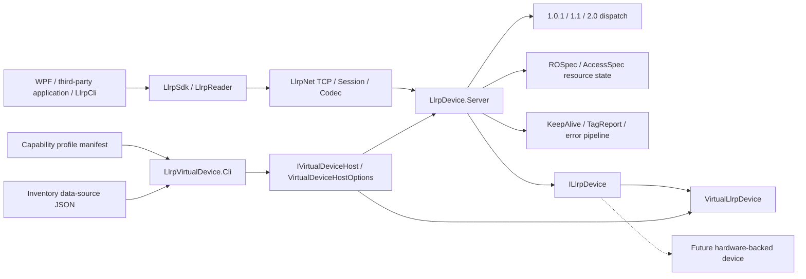
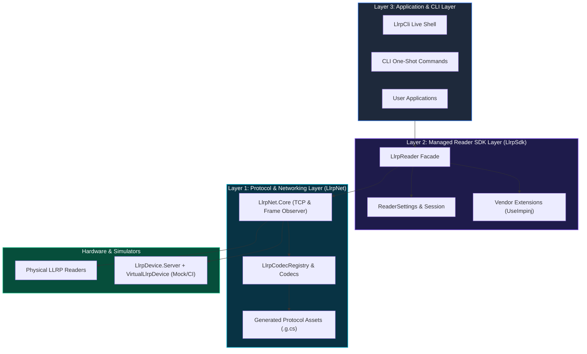

# Architecture Overview

[中文](overview.zh.md)

This document describes the long-term architecture boundaries of the LLRP C# SDK. For the current implementation status, see [`../status.md`](../status.md). For development order, see [`../roadmap.md`](../roadmap.md).

## Project Positioning

This project is a modern .NET LLRP development kit, not just a binary codec library. It modernizes the traditional LTK.NET definition-and-generation model by separating protocol definitions, generated wire assets, codec registration, async transport, version adapters, and the managed Reader workflow.


## LLRP Device Server and Virtual Device Architecture

The message-level endpoint is now split into a generic device-side Server and a
device behavior contract. `VirtualLlrpDevice` is one implementation of that
contract; a future real RFID module can implement the same interface without
duplicating the LLRP server or resource state machine.

The `LlrpDevice.*` projects are the device-side virtual-reader boundary. They
accept ordinary LLRP client traffic over TCP; they do not call `LlrpSdk` and do
not replace the client SDK. `LlrpDevice.Server` implements the protocol/session
and resource/report behavior, `VirtualLlrpDevice` implements deterministic
reader behavior, and `LlrpDevice.Virtual.Hosting` exposes the composition to a
host application. Consequently, `LlrpSdk`, `LlrpCli`, and
external tools can exercise the virtual endpoint through the same LLRP wire
contract as a physical reader.

The Impinj R420 virtual profile has been validated with an Impinj ItemTest
2.10.0 LLRP client: the client connects over LLRP 1.0.1 and reaches inventory
start. This evidence covers the LLRP client path only; ItemTest services outside
LLRP (for example mDNS discovery and rshell/SSH) are not part of the virtual
device contract.

### Runtime ownership and message flow

| Boundary | Owns | Does not own |
|---|---|---|
| `LlrpSdk` / `LlrpCli` / WPF or third-party client | client connection, protocol operations, reader workflows, and client-side diagnostics | device listener lifecycle or virtual-device composition |
| `LlrpDevice.Virtual.Hosting` | virtual-device SDK facade, endpoint facts, start/stop/restart lifecycle | multi-device directory and cross-process recovery |
| `LlrpVirtualDevice.Cli` | foreground virtual-device process, JSON validation | multi-device management and automatic restart |
| `LlrpDevice.Server` | listener, sessions, version dispatch, resource graph, KeepAlive, reports, status mapping, fault hooks | fake tag state or hardware driver details |
| `ILlrpDevice` | identity, capabilities, configuration, inventory execution, Tag Access, device events | TCP, protocol-version types, ROSpec/AccessSpec CRUD |
| `VirtualLlrpDevice` | deterministic tags, memory, lock/kill state, `static`/`moving-tags`/`noisy` observations | LLRP wire handling and Server resource state |
| capability profile + inventory source | fixed reader capability selection and independent tag population | endpoint binding and LLRP runtime resource state |



The first inbound frame selects the explicit wire version from its LLRP header.
The Server owns the version adapter and translates wire ROSpec/AccessSpec data
to version-neutral device requests. The TCP port never selects a device
implementation or protocol profile.

### Device contract and local preset boundary

`LlrpDevice.Abstractions` contains no generated protocol or SDK references.
`LlrpDevice.Server` consumes `ILlrpDevice`; `LlrpDevice.Virtual` references only
the abstractions project. This is the migration seam for a future physical
device implementation.

The standalone CLI uses `VirtualDeviceConfiguration`, a versioned,
device behavior document. Capability selection is represented by the
`llrp1.0.1_standard` manifest under `src/LlrpDevice.Virtual/config/llrp/caps`;
inventory tags are provided by an independent `IVirtualInventoryDataSource` and
can be loaded from `src/LlrpDevice.Virtual/config/llrp/data-sources/default.json`
or another source path. The
configuration does not persist the listen address, port, client limit, or
runtime ROSpec/AccessSpec graph. The LLRP client still owns wire-level
`ADD_ROSPEC`/`START_ROSPEC` messages, and endpoint overrides are supplied only
on the create/run command.

## Final Project Tree

The final repository and solution grouping is shown below. `LlrpCli` and
`LlrpVirtualDevice.Cli` remain directly under `src`; client applications and
device-side projects are separate boundaries that share the same `LlrpNet`
communication and protocol layer.

```text
LLRPCSharp/
├── LLRPCSharp.slnx                     [solution]
├── /src/
│   ├── LlrpCli/                         [general client CLI, directly under src]
│   ├── LlrpVirtualDevice.Cli/           [virtual-device CLI, directly under src]
│   ├── LlrpNet/                         [solution folder: transport + protocol]
│   │   ├── LlrpNet.Core/
│   │   ├── LlrpNet.Protocol/
│   │   ├── LlrpNet.Protocol.Impinj/
│   │   ├── LlrpNet.Protocol.Zebra/
│   │   ├── LlrpNet.ProtocolModel/
│   │   ├── LlrpNet.ProtocolGenerator/
│   │   └── LlrpNet.ProtocolGenerator.Tool/
│   ├── LlrpSdk/                          [solution folder: SDK layer]
│   │   ├── LlrpSdk/                      [LlrpReader and high-level SDK]
│   │   ├── LlrpSdk.Extensions.Abstractions/
│   │   ├── LlrpSdk.Extensions.Impinj/
│   │   ├── LlrpSdk.Extensions.Seuic/
│   │   └── LlrpSdk.Extensions.Zebra/
│   ├── LlrpDevice.Abstractions/         [version-neutral device contract]
│   ├── LlrpDevice.Server/                [generic LLRP device-side service]
│   ├── LlrpDevice.Virtual/               [deterministic device implementation]
│   └── LlrpDevice.Virtual.Hosting/       [virtual-device SDK facade]
├── /tests/                               [unit, interop, hardware, and virtual tests]
└── /tools/                               [smoke and protocol probe tools]
```

The detailed source-generation boundaries and the complete test-project list are
maintained in [`source-structure.md`](source-structure.md).

<details>
<summary><b>View Native Mermaid Architecture Diagram</b></summary>



</details>

The main product surface is `LlrpSdk.LlrpReader`: a device session object for one RFID reader. It owns connection management, protocol negotiation, initialization, inventory, resource management, message diagnostics, and extension lifecycle.

```text
Application / CLI
    |
    v
LlrpSdk.LlrpReader
    |-- High-level operations: Connect, Start, Stop, Inventory
    |-- Advanced resource services: RoSpecs, AccessSpecs
    |-- Raw protocol entry point: Protocol
    |-- Extension entry point: Extensions
    v
LlrpNet.Core + LlrpNet.Protocol + extension protocol modules
    v
TCP / LLRP binary protocol / real or virtual readers
```

## Core Principles

- One `LlrpReader` represents one reader. It does not inherit from a TCP client and does not expose internal sessions or managers to applications.
- Common application code uses version-neutral high-level models. Versioned Message/Parameter types belong to the protocol layer, advanced resource layer, and diagnostics.
- The CLI is a real SDK consumer. Online device operations reuse `LlrpReader`; offline encode/decode/inspect operations use the protocol layer.
- Handwritten core logic is separated from generated protocol assets. Generated assets are committed but not manually maintained.
- Standard domain models keep device hardware configuration (`ReaderConfiguration`) and inventory intent (`InventorySettings`) as explicit subdomains of the public `ReaderSettings` entry point. This preserves a stable, version-neutral contract while allowing vendor extension contributors; an additional monolithic Octane-style wrapper is not part of the current scope.
- Unknown standard or custom wire types should be preserved as Raw/Unknown where possible, instead of breaking standard message parsing.
- Vendor capabilities enter through two stages: Protocol Modules and Reader Extensions. The core SDK must not depend backward on a specific vendor.

## Module Boundaries

| Module | Responsibility |
|---|---|
| `LlrpNet.Core` | TCP lifecycle, frame splitting, transaction matching, timeout/cancellation, and raw frame observation. |
| `LlrpNet.Protocol` | Versioned messages, parameters, enumerations, codecs, registries, and Unknown/Raw types. |
| `LlrpNet.ProtocolModel` | Machine-readable protocol definition model plus XML/YAML import and validation inputs. |
| `LlrpNet.ProtocolGenerator` | C# type, codec, and registry module generation from protocol definitions. |
| `LlrpSdk` | `LlrpReader`, state machine, high-level inventory, resource services, version adapters, and extension lifecycle. |
| `LlrpCli` | General client-side command-line SDK consumer, diagnostics entry point, and regression helper. |
| `LlrpVirtualDevice.Cli` | Command-line consumer of the virtual-device SDK facade. |
| `LlrpDevice.Abstractions` | Version-neutral identity, configuration, inventory, Tag Access, and device-event contracts. |
| `LlrpDevice.Server` | Generic LLRP device-side TCP service, version dispatch, resource state, reports, and fault hooks. |
| `LlrpDevice.Virtual` | Deterministic in-memory implementation of `ILlrpDevice`, including RF-observable scenarios. |
| `LlrpDevice.Virtual.Hosting` | `IVirtualDeviceHost` and `VirtualDeviceHostOptions` facade that composes Server and Virtual device behavior; supports pre-start tag injection and the Impinj R420 profile. |

## Capability Layers

| Layer | Entry Point | Users | Versioned Type Visibility |
|---|---|---|---|
| High-level operations | `LlrpReader.ConnectAsync`, `QuerySettingsAsync`, `ApplySettingsAsync`, `StartInventoryAsync`, `InventorySession` | Applications and regular CLI workflows | Hidden |
| Advanced resources | `reader.RoSpecs`, `reader.AccessSpecs` | Integration code, resource-management CLI, protocol tests | Parameter models visible |
| Raw protocol | `reader.Protocol` | Protocol experts, diagnostics tools, unwrapped features | Visible |
| Protocol library | `LlrpCodecRegistry`, generated models, codecs | Offline tools, extension modules, SDK internals | Visible |
| Core | Transport, Session, Frame Observer | SDK/Protocol internals | Hidden |

## Version And Extension Strategy

LLRP version differences are hidden behind `ILlrpProtocolAdapter`. Business code uses `LlrpReader` and high-level models, while adapters map resource operations, inventory compilation, and report translation to a specific protocol version.

Extensions use two lifecycle stages:

- Protocol Module: registers Custom Message/Parameter types, codecs, and type mappings before connection.
- Reader Extension: matches and activates vendor capabilities after standard initialization using Manufacturer, Model, Firmware, and ProtocolVersion.
- If no Reader Extension matches, the connection remains a standard SDK connection: no vendor initialization or
  contributor pipeline runs, and applications must check the active extension before applying vendor Settings.

Codec conflicts for the same wire identity must fail rather than silently overwrite. If multiple Reader Extensions in the same non-empty exclusivity group match, connection should be rejected or require explicit selection.

## Design Constraints

- A graphical reader management application is not a current-phase goal.
- Planned APIs must not be described as current APIs; `docs/status.md` is the source of truth for current capabilities.
- Do not hand-edit generated `.g.cs` files.
- High-level inventory and tag-access operations own their SDK-reserved ROSpec/AccessSpec IDs while keeping desired settings separate from the observed device snapshot. The default `PreserveForeign` policy reconciles SDK-owned resources and preserves foreign resources; only explicit `ReplaceAll` uses LLRP ID zero to delete all standard resources. Expert writes are serialized with managed operations and may be followed immediately by a managed call.
- Raw Protocol operations must not silently corrupt managed intent. Read-only `GET_*` messages leave observation current; writes and exact frames mark observation stale without clearing DesiredState. `SynchronizeStateAsync()` refreshes the snapshot for inspection and is not a prerequisite for managed APIs.
