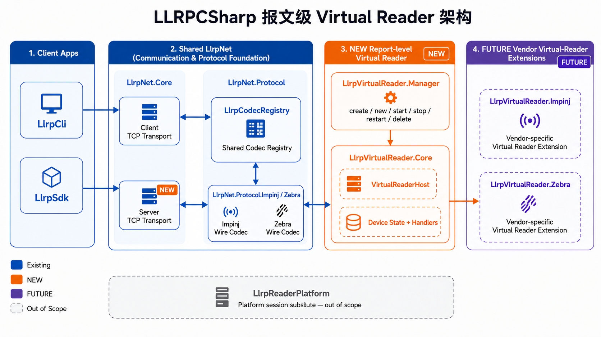
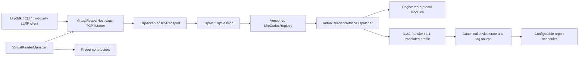
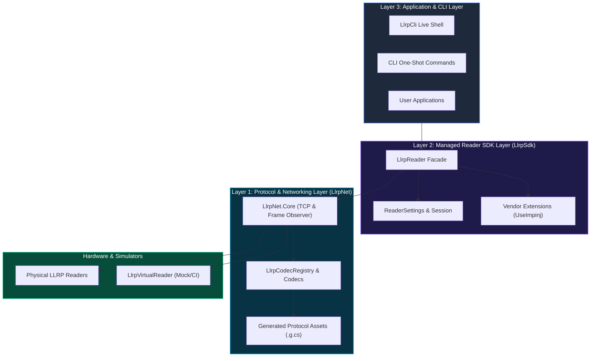

# Architecture Overview

[中文](overview.zh.md)

This document describes the long-term architecture boundaries of the LLRP C# SDK. For the current implementation status, see [`../status.md`](../status.md). For development order, see [`../roadmap.md`](../roadmap.md).

## Project Positioning

This project is a modern .NET LLRP development kit, not just a binary codec library. It modernizes the traditional LTK.NET definition-and-generation model by separating protocol definitions, generated wire assets, codec registration, async transport, version adapters, and the managed Reader workflow.


## Message-Level Virtual Reader Architecture



This companion diagram shows the message-level Virtual Reader boundary. `NEW` marks the
new Core/Manager implementation, `FUTURE` marks vendor-specific virtual-reader extension
points, and `LlrpReaderPlatform` remains outside this TCP/LLRP scope. The editable Mermaid
source is [`virtual-reader-architecture.mmd`](virtual-reader-architecture.mmd).

### Runtime ownership and message flow

| Boundary | Owns | Does not own |
|---|---|---|
| `VirtualReaderManager` | instance identity, preset lookup, create/start/stop/restart/delete/list/status | wire framing, ROSpec state, tag-memory semantics |
| `VirtualReaderHost` | one exact TCP endpoint, client limit, lifecycle, accepted sessions, report loops | another instance's resources or SDK client state |
| `LlrpNet` transport/session/registry | frame assembly, send/receive, transaction-safe session plumbing, versioned codec lookup | device policy and resource transitions |
| version profile + handlers | status/error mapping, initialization, capabilities/config, ROSpec/AccessSpec transitions, events, reports | Manager instance directory |



The first inbound frame selects the explicit wire version from its LLRP header.
For 1.1, version negotiation is handled before standard dispatch, then shared
standard messages are translated into one canonical 1.0.1 state and translated
back only at the wire boundary. The TCP port never selects a protocol profile.

## Final Project Tree

The final repository and solution grouping is shown below. `LlrpCli` remains directly
under `src`; the SDK and Virtual Reader are separate solution folders that share the
same `LlrpNet` communication and protocol layer.

```text
LLRPCSharp/
├── LLRPCSharp.slnx                     [solution]
├── /src/
│   ├── LlrpCli/                         [project directly under src]
│   ├── LlrpNet/                         [solution folder: transport + protocol]
│   │   ├── LlrpNet.Core/
│   │   ├── LlrpNet.Protocol/
│   │   ├── LlrpNet.Protocol.Impinj/
│   │   ├── LlrpNet.Protocol.Zebra/
│   │   ├── LlrpNet.ProtocolModel/
│   │   ├── LlrpNet.ProtocolGenerator/
│   │   └── LlrpNet.ProtocolGenerator.Tool/
│   ├── LlrpSdk/                          [solution folder: SDK layer]
│   │   ├── LlrpSdk/                      [LlrpReader and high-level SDK]
│   │   ├── LlrpSdk.Extensions.Abstractions/
│   │   ├── LlrpSdk.Extensions.Impinj/
│   │   ├── LlrpSdk.Extensions.Seuic/
│   │   └── LlrpSdk.Extensions.Zebra/
│   └── LlrpVirtualReader/                [solution folder: message-level device]
│       ├── LlrpVirtualReader.Core/       [NEW: one virtual reader host]
│       ├── LlrpVirtualReader.Manager/     [NEW: multi-host lifecycle]
│       └── LlrpVirtualReader/             [compatibility launcher]
├── /tests/                               [unit, interop, hardware, and virtual tests]
└── /tools/                               [smoke and protocol probe tools]
```

The detailed source-generation boundaries and the complete test-project list are
maintained in [`source-structure.md`](source-structure.md).

<details>
<summary><b>View Native Mermaid Architecture Diagram</b></summary>



</details>

The main product surface is `LlrpSdk.LlrpReader`: a device session object for one RFID reader. It owns connection management, protocol negotiation, initialization, inventory, resource management, message diagnostics, and extension lifecycle.

```text
Application / CLI
    |
    v
LlrpSdk.LlrpReader
    |-- High-level operations: Connect, Start, Stop, Inventory
    |-- Advanced resource services: RoSpecs, AccessSpecs
    |-- Raw protocol entry point: Protocol
    |-- Extension entry point: Extensions
    v
LlrpNet.Core + LlrpNet.Protocol + extension protocol modules
    v
TCP / LLRP binary protocol / real or virtual readers
```

## Core Principles

- One `LlrpReader` represents one reader. It does not inherit from a TCP client and does not expose internal sessions or managers to applications.
- Common application code uses version-neutral high-level models. Versioned Message/Parameter types belong to the protocol layer, advanced resource layer, and diagnostics.
- The CLI is a real SDK consumer. Online device operations reuse `LlrpReader`; offline encode/decode/inspect operations use the protocol layer.
- Handwritten core logic is separated from generated protocol assets. Generated assets are committed but not manually maintained.
- Standard domain models cleanly separate device hardware configuration (`ReaderConfiguration`) from inventory intent (`InventorySettings`). Unlike Impinj Octane SDK which bundles hardware configuration and ROSpec parameters into a single monolithic `Settings` class, `LLRPCSharp` maintains explicit decoupling while supporting vendor extension contributors. An Impinj-Octane-style facade helper wrapper is planned for future evaluation.
- Unknown standard or custom wire types should be preserved as Raw/Unknown where possible, instead of breaking standard message parsing.
- Vendor capabilities enter through two stages: Protocol Modules and Reader Extensions. The core SDK must not depend backward on a specific vendor.

## Module Boundaries

| Module | Responsibility |
|---|---|
| `LlrpNet.Core` | TCP lifecycle, frame splitting, transaction matching, timeout/cancellation, and raw frame observation. |
| `LlrpNet.Protocol` | Versioned messages, parameters, enumerations, codecs, registries, and Unknown/Raw types. |
| `LlrpNet.ProtocolModel` | Machine-readable protocol definition model plus XML/YAML import and validation inputs. |
| `LlrpNet.ProtocolGenerator` | C# type, codec, and registry module generation from protocol definitions. |
| `LlrpSdk` | `LlrpReader`, state machine, high-level inventory, resource services, version adapters, and extension lifecycle. |
| `LlrpCli` | Command-line SDK consumer, diagnostics entry point, and regression helper. |
| `LlrpVirtualReader` | Local virtual reader for hardware-free development, interoperability, and fault-scenario testing. |

## Capability Layers

| Layer | Entry Point | Users | Versioned Type Visibility |
|---|---|---|---|
| High-level operations | `LlrpReader.ConnectAsync`, `QuerySettingsAsync`, `ApplySettingsAsync`, `StartInventoryAsync`, `InventorySession` | Applications and regular CLI workflows | Hidden |
| Advanced resources | `reader.RoSpecs`, `reader.AccessSpecs` | Integration code, resource-management CLI, protocol tests | Parameter models visible |
| Raw protocol | `reader.Protocol` | Protocol experts, diagnostics tools, unwrapped features | Visible |
| Protocol library | `LlrpCodecRegistry`, generated models, codecs | Offline tools, extension modules, SDK internals | Visible |
| Core | Transport, Session, Frame Observer | SDK/Protocol internals | Hidden |

## Version And Extension Strategy

LLRP version differences are hidden behind `ILlrpProtocolAdapter`. Business code uses `LlrpReader` and high-level models, while adapters map resource operations, inventory compilation, and report translation to a specific protocol version.

Extensions use two lifecycle stages:

- Protocol Module: registers Custom Message/Parameter types, codecs, and type mappings before connection.
- Reader Extension: matches and activates vendor capabilities after standard initialization using Manufacturer, Model, Firmware, and ProtocolVersion.

Codec conflicts for the same wire identity must fail rather than silently overwrite. If multiple Reader Extensions in the same non-empty exclusivity group match, connection should be rejected or require explicit selection.

## Design Constraints

- A graphical reader management application is not a current-phase goal.
- Planned APIs must not be described as current APIs; `docs/status.md` is the source of truth for current capabilities.
- Do not hand-edit generated `.g.cs` files.
- High-level inventory and tag-access operations exclusively own reader ROSpec and AccessSpec resources: they clear existing resources before compiling their single managed ROSpec. Expert resource writes require explicit manual resource mode and are mutually exclusive with managed inventory.
- Raw Protocol operations must not silently corrupt managed state. If a raw operation changes device state, managed caches must be invalidated and synchronization required.
