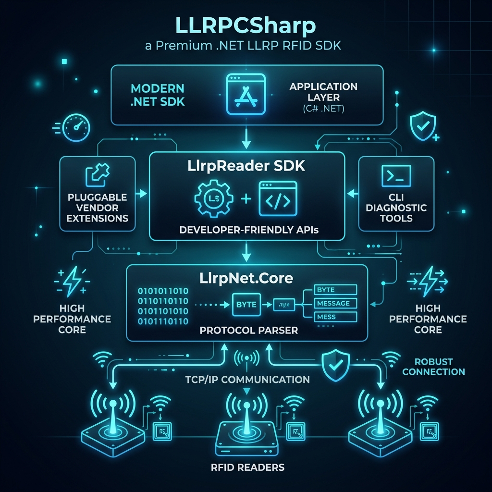

# 架构总览

[English](overview.md)

本文说明 LLRP C# SDK 的长期设计边界。当前实现状态见 [`../status.md`](../status.md)，开发顺序见 [`../roadmap.md`](../roadmap.md)。

## 项目定位

本项目是一套现代化 .NET LLRP 开发套件，而不只是二进制编解码库。



核心产品是 `LlrpSdk.LlrpReader`：一个代表单台 RFID 读写器的设备会话对象，负责连接、协议协商、初始化、盘点、资源管理、报文诊断和扩展生命周期。

```text
应用 / CLI
    |
    v
LlrpSdk.LlrpReader
    |-- 高频业务能力：Connect、Start、Stop、Inventory
    |-- 进阶资源服务：RoSpecs、AccessSpecs
    |-- 原始协议入口：Protocol
    |-- 扩展入口：Extensions
    v
LlrpNet.Core + LlrpNet.Protocol + 扩展协议模块
    v
TCP / LLRP 二进制协议 / 真实或虚拟读写器
```

## 核心原则

- 一个 `LlrpReader` 对应一台读写器，不继承 TCP Client，也不向应用泄漏内部 Session/Manager。
- 普通业务面对版本无关的高级模型；版本化 Message/Parameter 只属于协议层、进阶资源层和诊断场景。
- CLI 是 SDK 的真实消费方。在线设备操作复用 `LlrpReader`，离线 encode/decode/inspect 使用协议层。
- 手写核心逻辑与生成协议资产分离。生成资产提交到仓库，但不手工维护。
- 标准领域模型严格解耦设备硬件配置 (`ReaderConfiguration`) 与单次盘点意图 (`InventorySettings`)。相比 Impinj Octane SDK 将硬件配置与 ROSpec 参数打包在单一 `Settings` 大对象中的做法，`LLRPCSharp` 保持显式解耦并支持厂商扩展管道，未来保留对 Impinj Octane 式 Facade 快捷包装包的规划评估。
- 未知标准类型或 Custom 类型应尽量保留为 Raw/Unknown，不能轻易破坏标准报文解析。
- 厂商能力通过 Protocol Module 和 Reader Extension 两阶段接入，避免核心 SDK 反向依赖具体厂商。

## 模块边界

| 模块 | 职责 |
|---|---|
| `LlrpNet.Core` | TCP 生命周期、帧切分、事务匹配、超时取消、原始帧观测。 |
| `LlrpNet.Protocol` | 版本化消息/参数/枚举、Codec、Registry、Unknown/Raw 类型。 |
| `LlrpNet.ProtocolModel` | 机器可读协议定义模型、XML/YAML 导入和校验输入。 |
| `LlrpNet.ProtocolGenerator` | 从协议定义生成 C# 类型、Codec 和 Registry Module。 |
| `LlrpSdk` | `LlrpReader`、状态机、高级盘点、资源服务、版本 Adapter、扩展生命周期。 |
| `LlrpCli` | SDK 的命令行使用者、诊断入口和回归辅助工具。 |
| `LlrpVirtualReader` | 本地虚拟读写器，用于无硬件开发、互操作和故障场景测试。 |

## 能力分层

| 层次 | 入口 | 使用者 | 版本化协议类型可见性 |
|---|---|---|---|
| 高级能力 | `LlrpReader.ConnectAsync`、`StartAsync`、`StopAsync`、`InventoryAsync` | 普通应用、常规 CLI | 不可见 |
| 进阶资源 | `reader.RoSpecs`、`reader.AccessSpecs` | 集成开发、资源管理 CLI、协议测试 | 参数模型可见 |
| 原始协议 | `reader.Protocol` | 协议专家、诊断工具、未封装功能 | 可见 |
| 协议库 | `LlrpCodecRegistry`、生成模型、Codec | 离线工具、扩展模块、SDK 内部 | 可见 |
| Core | Transport、Session、Frame Observer | SDK/Protocol 内部 | 不可见 |

## 版本与扩展策略

LLRP 版本差异由 `ILlrpProtocolAdapter` 屏蔽。业务层面对统一的 `LlrpReader` 和高级模型，Adapter 负责将资源操作、盘点编译和报告翻译映射到具体协议版本。

扩展分成两个生命周期：

- Protocol Module：连接前注册 Custom Message/Parameter、Codec 和类型映射。
- Reader Extension：标准初始化后按 Manufacturer/Model/Firmware/ProtocolVersion 匹配并激活厂商能力。

同一 wire identity 的 Codec 冲突必须失败，不能静默覆盖。同一非空互斥组的多个 Reader Extension 同时匹配时，应拒绝连接或要求显式选择。

## 设计约束

- 不建设图形化上位机作为当前阶段目标。
- 不把规划中的 API 当作当前 API；当前能力以 `docs/status.md` 为准。
- 不手写生成目录下的 `.g.cs`。
- 不让 Raw Protocol 操作悄悄污染 Managed 状态；Raw 改变设备状态后必须失效缓存并要求同步。
