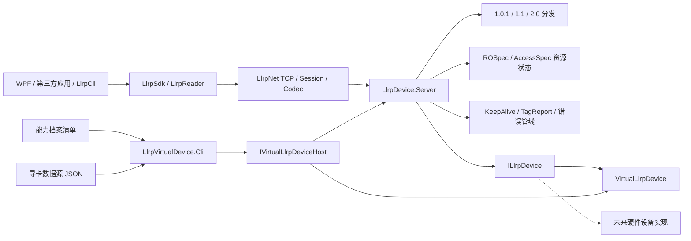
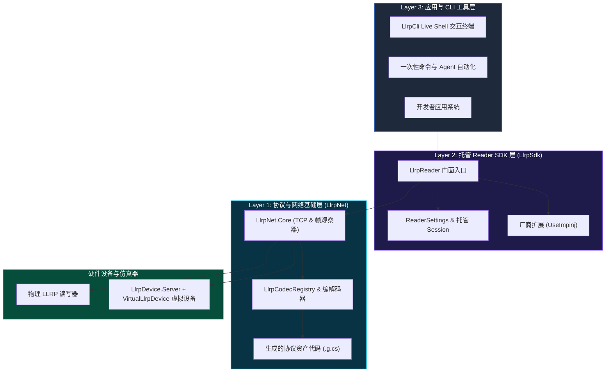

# 架构总览

[English](overview.md)

本文说明 LLRP C# SDK 的长期设计边界。当前实现状态见 [`../status.md`](../status.md)，开发顺序见 [`../roadmap.md`](../roadmap.md)。

## 项目定位

本项目是一套现代化 .NET LLRP 开发套件，而不只是二进制编解码库。它对传统 LTK.NET 的定义与生成模式进行现代化改造，将协议定义、生成的线级资产、Codec 注册、异步传输、版本 Adapter 和托管 Reader 工作流拆分开来。


## LLRP Device Server 与 Virtual Device 架构

报文级设备端现在拆成通用设备端 Server 与设备行为合同。
`VirtualLlrpDevice` 是该合同的一种实现；未来真实 RFID 模块可以实现同一个接口，
无需复制 LLRP 服务或资源状态机。

### 运行时职责与报文流

| 边界 | 负责 | 不负责 |
|---|---|---|
| `LlrpSdk` / `LlrpCli` / WPF 或第三方客户端 | 客户端连接、协议操作、Reader 工作流和客户端诊断 | 设备监听器生命周期或虚拟设备组合 |
| `LlrpDevice.Virtual.Hosting` | 单台设备 SDK 门面、端点信息、启动/停止/重启生命周期 | 多设备目录和跨进程恢复 |
| `LlrpVirtualDevice.Cli` | 一个前台进程托管一台虚拟设备、单设备 JSON 校验 | 多设备管理和自动重启 |
| `LlrpDevice.Server` | Listener、Session、版本分发、资源图、KeepAlive、报告、状态映射、故障 Hook | 假标签状态或硬件驱动细节 |
| `ILlrpDevice` | 身份、能力、配置、盘点执行、Tag Access、设备事件 | TCP、协议版本类型、ROSpec/AccessSpec CRUD |
| `VirtualLlrpDevice` | 确定性标签、内存、锁/销毁状态、`static`/`moving-tags`/`noisy` 观察 | LLRP 报文处理和 Server 资源状态 |
| 能力档案 + 寻卡数据源 | 固定读写器能力选择与独立标签数据 | 端点绑定与 LLRP 运行资源状态 |



第一帧从 LLRP Header 选择显式线协议版本。Server 持有版本 Adapter，并将线级
ROSpec/AccessSpec 转成版本中立的设备请求；TCP 端口不选择设备实现或协议 Profile。

### 设备合同与本地预设边界

`LlrpDevice.Abstractions` 不引用生成协议或 SDK；`LlrpDevice.Server` 消费
`ILlrpDevice`；`LlrpDevice.Virtual` 只引用 Abstractions。这就是未来真实设备实现的迁移
接缝。

独立 CLI 使用 `VirtualDeviceConfiguration` 持久化版本化的单设备行为选择。
`src/LlrpDevice.Virtual/config/llrp/caps` 下的 `llrp1.0.1_standard` 能力档案负责固定读写器能力；
标签由独立的 `IVirtualInventoryDataSource` 提供，可使用
`src/LlrpDevice.Virtual/config/llrp/data-sources/default.json` 或另一个数据源路径。配置不保存监听地址、
端口、连接数或运行中的 ROSpec/AccessSpec 图；端点改变只通过 create/run 命令参数传入。
线级 `ADD_ROSPEC`/`START_ROSPEC` 仍由 LLRP 客户端发送，`--config` 仍然只在显式提供时加载。

## 最终项目结构 Tree

下面是最终仓库与解决方案分组。`LlrpCli` 与 `LlrpVirtualDevice.Cli` 都直接位于
`src` 下；客户端应用与设备端项目职责分离，共同复用 `LlrpNet` 通信与协议层。

```text
LLRPCSharp/
├── LLRPCSharp.slnx                     [解决方案]
├── /src/
│   ├── LlrpCli/                         [通用客户端 CLI，项目直接位于 src 下]
│   ├── LlrpVirtualDevice.Cli/           [单台设备 CLI，项目直接位于 src 下]
│   ├── LlrpNet/                         [解决方案文件夹：通信层 + 协议层]
│   │   ├── LlrpNet.Core/
│   │   ├── LlrpNet.Protocol/
│   │   ├── LlrpNet.Protocol.Impinj/
│   │   ├── LlrpNet.Protocol.Zebra/
│   │   ├── LlrpNet.ProtocolModel/
│   │   ├── LlrpNet.ProtocolGenerator/
│   │   └── LlrpNet.ProtocolGenerator.Tool/
│   ├── LlrpSdk/                          [解决方案文件夹：SDK 层]
│   │   ├── LlrpSdk/                      [LlrpReader 与高级 SDK]
│   │   ├── LlrpSdk.Extensions.Abstractions/
│   │   ├── LlrpSdk.Extensions.Impinj/
│   │   ├── LlrpSdk.Extensions.Seuic/
│   │   └── LlrpSdk.Extensions.Zebra/
│   ├── LlrpDevice.Abstractions/         [版本中立设备合同]
│   ├── LlrpDevice.Server/               [通用 LLRP 设备端服务]
│   ├── LlrpDevice.Virtual/              [确定性设备实现]
│   └── LlrpDevice.Virtual.Hosting/      [单台设备 SDK 门面]
├── /tests/                               [单元、互操作、硬件和虚拟设备测试]
└── /tools/                               [Smoke 与协议探针工具]
```

完整的源码生成边界和测试项目清单维护在
[`source-structure.md`](source-structure.md) 中。

<details>
<summary><b>查看原生 Mermaid 架构图</b></summary>



</details>

核心产品是 `LlrpSdk.LlrpReader`：一个代表单台 RFID 读写器的设备会话对象，负责连接、协议协商、初始化、盘点、资源管理、报文诊断和扩展生命周期。

```text
应用 / CLI
    |
    v
LlrpSdk.LlrpReader
    |-- 高频业务能力：Connect、Start、Stop、Inventory
    |-- 进阶资源服务：RoSpecs、AccessSpecs
    |-- 原始协议入口：Protocol
    |-- 扩展入口：Extensions
    v
LlrpNet.Core + LlrpNet.Protocol + 扩展协议模块
    v
TCP / LLRP 二进制协议 / 真实或虚拟读写器
```

## 核心原则

- 一个 `LlrpReader` 对应一台读写器，不继承 TCP Client，也不向应用泄漏内部 Session/Manager。
- 普通业务面对版本无关的高级模型；版本化 Message/Parameter 只属于协议层、进阶资源层和诊断场景。
- CLI 是 SDK 的真实消费方。在线设备操作复用 `LlrpReader`，离线 encode/decode/inspect 使用协议层。
- 手写核心逻辑与生成协议资产分离。生成资产提交到仓库，但不手工维护。
- 标准领域模型严格解耦设备硬件配置 (`ReaderConfiguration`) 与单次盘点意图 (`InventorySettings`)。相比 Impinj Octane SDK 将硬件配置与 ROSpec 参数打包在单一 `Settings` 大对象中的做法，`LLRPCSharp` 保持显式解耦并支持厂商扩展管道，未来保留对 Impinj Octane 式 Facade 快捷包装包的规划评估。
- 未知标准类型或 Custom 类型应尽量保留为 Raw/Unknown，不能轻易破坏标准报文解析。
- 厂商能力通过 Protocol Module 和 Reader Extension 两阶段接入，避免核心 SDK 反向依赖具体厂商。

## 模块边界

| 模块 | 职责 |
|---|---|
| `LlrpNet.Core` | TCP 生命周期、帧切分、事务匹配、超时取消、原始帧观测。 |
| `LlrpNet.Protocol` | 版本化消息/参数/枚举、Codec、Registry、Unknown/Raw 类型。 |
| `LlrpNet.ProtocolModel` | 机器可读协议定义模型、XML/YAML 导入和校验输入。 |
| `LlrpNet.ProtocolGenerator` | 从协议定义生成 C# 类型、Codec 和 Registry Module。 |
| `LlrpSdk` | `LlrpReader`、状态机、高级盘点、资源服务、版本 Adapter、扩展生命周期。 |
| `LlrpCli` | 通用客户端 SDK 的命令行使用者、诊断入口和回归辅助工具。 |
| `LlrpVirtualDevice.Cli` | 单台虚拟设备 SDK 门面的命令行使用者。 |
| `LlrpDevice.Abstractions` | 版本中立的身份、配置、盘点、Tag Access 与设备事件合同。 |
| `LlrpDevice.Server` | 通用 LLRP 设备端 TCP 服务、版本分发、资源状态、报告和故障 Hook。 |
| `LlrpDevice.Virtual` | `ILlrpDevice` 的确定性内存实现，包含 RF 可观察场景。 |
| `LlrpDevice.Virtual.Hosting` | 组合一台 Server 和一台 Virtual 设备的 `IVirtualLlrpDeviceHost` 门面。 |

## 能力分层

| 层次 | 入口 | 使用者 | 版本化协议类型可见性 |
|---|---|---|---|
| 高级能力 | `LlrpReader.ConnectAsync`、`QuerySettingsAsync`、`ApplySettingsAsync`、`StartInventoryAsync`、`InventorySession` | 普通应用、常规 CLI | 不可见 |
| 进阶资源 | `reader.RoSpecs`、`reader.AccessSpecs` | 集成开发、资源管理 CLI、协议测试 | 参数模型可见 |
| 原始协议 | `reader.Protocol` | 协议专家、诊断工具、未封装功能 | 可见 |
| 协议库 | `LlrpCodecRegistry`、生成模型、Codec | 离线工具、扩展模块、SDK 内部 | 可见 |
| Core | Transport、Session、Frame Observer | SDK/Protocol 内部 | 不可见 |

## 版本与扩展策略

LLRP 版本差异由 `ILlrpProtocolAdapter` 屏蔽。业务层面对统一的 `LlrpReader` 和高级模型，Adapter 负责将资源操作、盘点编译和报告翻译映射到具体协议版本。

扩展分成两个生命周期：

- Protocol Module：连接前注册 Custom Message/Parameter、Codec 和类型映射。
- Reader Extension：标准初始化后按 Manufacturer/Model/Firmware/ProtocolVersion 匹配并激活厂商能力。

同一 wire identity 的 Codec 冲突必须失败，不能静默覆盖。同一非空互斥组的多个 Reader Extension 同时匹配时，应拒绝连接或要求显式选择。

## 设计约束

- 不建设图形化上位机作为当前阶段目标。
- 不把规划中的 API 当作当前 API；当前能力以 `docs/status.md` 为准。
- 不手写生成目录下的 `.g.cs`。
- 不让 Raw Protocol 操作悄悄污染 Managed 状态；Raw 改变设备状态后必须失效缓存并要求同步。
