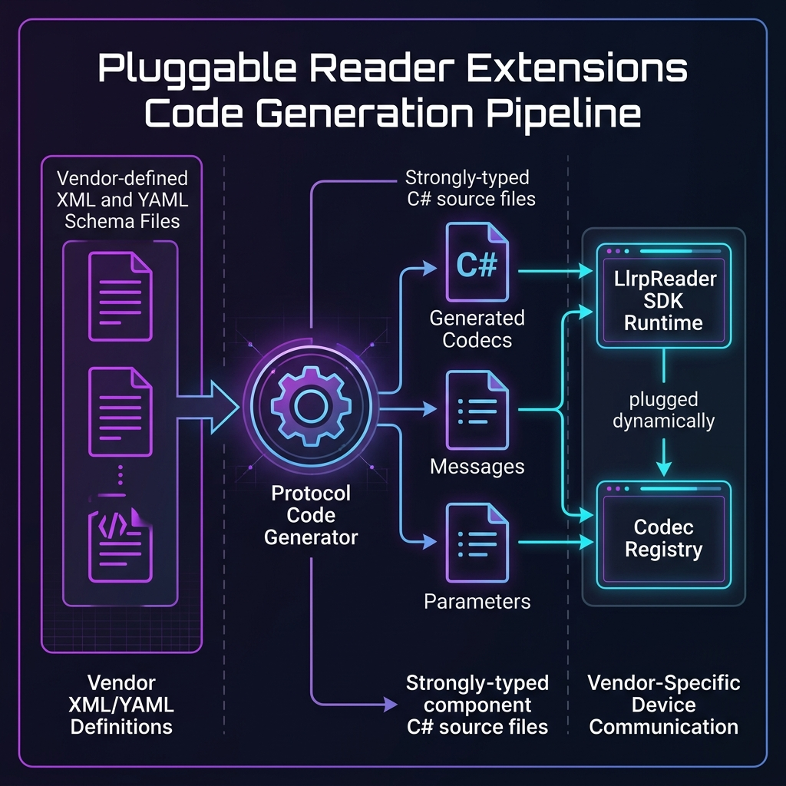

# LLRP Protocol Extension And Definition Guide

[中文](protocol-extension-guide.zh.md)

> **Path**: `docs/architecture/protocol-extension-guide.md`  
> **Audience**: project developers, integrators, and customer technical teams  
> **Core rule**: XML is the fixed historical baseline. The SDK already has 1.0.1 / 1.1 support, while 2.0 has YAML delta definitions and still needs an adapter. Customers only need YAML deltas for vendor extensions and future protocol versions.

## 1. XML Baseline And YAML Deltas

In `LLRPCSharp`, protocol definition ownership is intentionally strict: legacy XML stays as a fixed baseline, while new standard deltas, vendor extensions, and project-specific extensions should use YAML deltas.

```text
+------------------------------------------------------------------------+
| 1. Fixed XML baseline                                                   |
|    - LLRP 1.0.1 standard reader definition                              |
|    - Local Impinj 1.0.1 extension input                                 |
|    - Historical inputs imported into the normalized ProtocolModel        |
+-----------------------------------+------------------------------------+
                                    |
                                    v
+------------------------------------------------------------------------+
| 2. YAML deltas for new scenarios                                        |
|    - SDK-provided LLRP 1.1 and 2.0 deltas                               |
|    - New vendors such as Zebra, Alien, or private reader extensions      |
|    - Project-specific custom messages, parameters, and future standards  |
+------------------------------------------------------------------------+
```

## 2. Scenario Guide

### Scenario 1: Standard 1.0.1 / 1.1 Readers, Or Impinj 1.0.1 Readers

- **Customer input**: no files are required.
- **SDK behavior**:
  - LLRP 1.0.1 standard support and Impinj 1.0.1 extensions are precompiled from local XML inputs. The current Impinj input is LTK Definition Files 10.58.0 with 4 custom messages, 104 custom parameters, and 49 custom enumerations. The original XML is not redistributed; generated wire models and codecs live in the SDK-independent `LlrpNet.Protocol.Impinj`, while high-level mappings live in `LlrpSdk.Extensions.Impinj`.
  - LLRP 1.1 is generated from the SDK-provided `llrp-1.1.yaml`. LLRP 2.0 has `llrp-2.0-delta.yaml` in the repository, but it becomes a usable SDK protocol version only after the V2 adapter and negotiation path are implemented.

### Scenario 2: Integrating A New Third-Party Vendor Reader

- **Customer input**:
  1. Read the vendor's LLRP extension manual and collect the official Vendor ID, private message/parameter subtype values, and field definitions.
  2. Create a YAML delta under `definitions/extensions/`, for example `definitions/extensions/zebra.yaml`.

```yaml
# definitions/extensions/zebra.yaml
name: "ZebraExtension"
vendor_id: 10086
base_version: "1.0.1"

parameters:
  - name: "ZebraCustomFrequencySpec"
    subtype: 1
    type: "TLV"
    fields:
      - name: "ChannelHopRate"
        type: "U16"

parameter_extensions:
  - target_parameter: "ROReportSpec"
    allowed_custom_parameters:
      - "ZebraCustomFrequencySpec"
```

### Scenario 3: Project-Specific Private Extensions

- Create a project YAML file under `definitions/extensions/`, for example `definitions/extensions/custom-project-a.yaml`.
- The SDK core does not need to change. Use the generator to produce an independent extension module assembly such as `LlrpSdk.Extensions.ProjectA`.

### Scenario 4: Future Standard Protocol Versions

If a future standard protocol version is not yet built into the SDK, add a corresponding YAML delta under `definitions/`, for example `definitions/llrp-3.0-delta.yaml`.

## 3. Generation Pipeline

The generation pipeline is the same regardless of which scenario produced the YAML delta.



```text
[ Fixed XML baseline ] (1.0.1 standard / local Impinj input)
         |
         v
[ Normalized ProtocolModel ] <--- merge --- [ YAML deltas ]
         |
         v
[ Generated strongly typed C# models, codecs, and registry modules ]
```

## 4. Quick Reference

| Scenario | Format | Owner | Customer YAML? |
|---|---|---|---|
| 1.0.1 standard reader | XML | Provided by this project | No |
| Impinj 1.0.1 reader | Local XML | Precompiled extension DLL | No |
| LLRP 1.1 standard | YAML delta | Provided by the SDK | No |
| LLRP 2.0 standard | YAML delta | Provided by the SDK, adapter pending | No, once implemented |
| New vendor reader | YAML delta | Customer or integrator | Yes |
| Project-specific messages | YAML delta | Customer project team | Yes |
| Future standard | YAML delta | Developer or integrator | Yes |

## 5. Future Plan: Runtime YAML Loading

> Current status: this section is a future plan, not a current SDK API. `WithDynamicYamlExtension(...)`, `DynamicCustomParameter`, and `DynamicYamlCodec` are not implemented. The available mode today is static generation of an extension assembly plus protocol module registration.

To support niche or private devices without rebuilding an assembly, the architecture leaves room for runtime interpretation of external YAML files.

```text
[ External YAML delta ]
        |
        v
[ Runtime ProtocolModel metadata ]
        |
        v
[ DynamicYamlCodec ]
        |
        v
[ DynamicCustomParameter dictionary model registered in LlrpCodecRegistry ]
```

| Dimension | Static Generation | Runtime Loading |
|---|---|---|
| Code generation | Compile-time C# generation | No generated code |
| Deployment | Build and ship an assembly | Drop in a YAML file |
| Developer experience | Strongly typed C# and IntelliSense | Dictionary or dynamic field access |
| Runtime performance | Native C# codecs, best performance | Interpreted, suitable for lighter scenarios |
